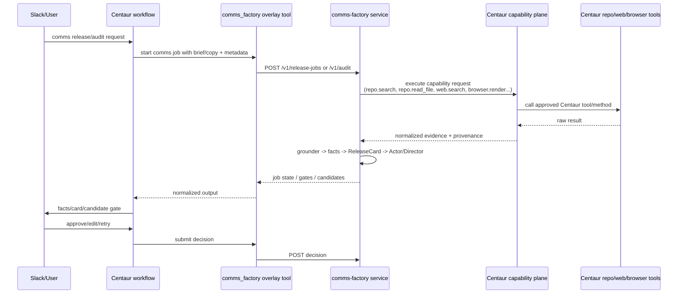

# refactor: Move comms-factory research access onto Centaur capability plane

## Summary

Build a clean two-repo integration where **Centaur owns operational capabilities** and **comms-factory owns comms reasoning**.

The current comms-factory pipeline has the right reasoning shape, but the wrong capability boundary: its grounder directly shells out to local repo grep/read, `gh`, `git`, `agent-browser`, ProjectJin, and ad-hoc HTTP fetches. Those are Centaur responsibilities. The pipeline should ask for repo/web/browser/search capabilities through Centaur, receive normalized evidence with provenance, and keep all ReleaseCard / Actor / Director / validator logic inside comms-factory.

**Target repos:**

- `centaur` — generic capability plane, repo capability tool, comms overlay wiring.
- `comms-factory` — capability-plane executor, grounder refactor, docs/tests removing local infra assumptions.

---

## Problem Frame

The previous integration split was directionally right — Centaur as workflow/supervisor, comms-factory as attached domain service — but it still left comms-factory carrying too much infrastructure:

- `src/fact-grounder/sources/platform-code.ts` uses `PLATFORM_ROOT`, local grep, `git grep`, and `git show`.
- `src/fact-grounder/sources/branch-discovery.ts` uses local `gh`, `git ls-remote`, and branch fetches.
- `src/fact-grounder/sources/projectjin-research.ts` shells out to a local ProjectJin CLI.
- `src/fact-grounder/sources/rendered-page.ts` shells out to local browser automation.
- `src/research-tools.ts` has a switch statement that physically executes those capabilities.

That means comms-factory has to know where repos live, which CLI binaries are installed, how secrets are exposed, and which org tools exist. This duplicates Centaur’s purpose and makes the service hard to run cleanly in Kubernetes.

The desired boundary is:

| Concern | Owner |
|---|---|
| Decide what evidence is needed | comms-factory grounder |
| Execute repo search/read/ref discovery | Centaur |
| Execute web/browser/X/search tools | Centaur |
| Enforce tool/repo permissions | Centaur |
| Normalize evidence provenance | Centaur capability plane |
| Interpret evidence into verified facts | comms-factory |
| Build ReleaseCard | comms-factory |
| Generate and judge copy | comms-factory |
| Slack gates and workflow durability | Centaur |

---

## Documentation and Current Branch Baseline

This plan is grounded against the current Centaur extension docs and the current `feat/comms-factory-centaur-integration` worktree.

### Extension docs constraints

- Overlay docs (`/extend/overlay`) make overlays the canonical boundary for deployment-specific tools, workflows, skills, personas, prompts, and sandbox files. API-loaded extensions come from `/app/overlay/org`; sandbox-loaded skills/prompts come from `/home/agent/overlay/org`.
- Tool docs (`/extend/tools`) define tools as Python plugins loaded from `TOOL_DIRS` and exposed at `/tools/{name}/{method}`. Organization-specific tools belong under overlay `tools/`, not base `tools/`. Tool credentials are declared in `pyproject.toml` and resolved through `secret(...)` / iron-proxy, not global env when possible.
- Workflow docs (`/extend/workflows`) define durable workflow handlers loaded from `WORKFLOW_DIRS`; side effects must be behind `ctx.step(...)`, and external waits should use workflow events. Workflow webhooks exist for provider callbacks, but comms Slack gates should keep using workflow events rather than public webhooks.
- Skill docs (`/extend/skills`) are explicit that skills are instructions only: they do not grant network access. This plan should not use a comms skill as a substitute for repo/tool/browser capability access.
- Configuration docs (`/reference/configuration`) establish Helm values as the primary extension surface: `api.extraEnv`, `slackbot.extraEnv`, `sandbox.extraEnv`, and `overlay.*`. They also show `REPOS_PATH` is currently sandbox-oriented; API-side repo capability needs explicit config/mount work.
- Slack ETL docs (`/operate/slack-etl`) establish Slack history/context as a Centaur-owned workflow/data boundary with deliberate token scope. If comms-factory needs Slack history as evidence, it should consume Centaur-provided `company_context` / Slack ETL evidence, not receive Slack tokens or run its own Slack sync.

### Current branch state already done

Already present in the worktree:

- `overlays/comms-factory/` contains the comms overlay bundle with `Dockerfile`, `tools/comms_factory`, `workflows/comms_*`, and tests.
- Base `tools/comms_factory/**` and `workflows/comms_*` are deleted from the working tree.
- `services/api/api/workflow_engine.py` now supports sibling imports from overlay workflow directories.
- Slackbot command launch is generic through `SLACK_WORKFLOW_COMMANDS` instead of hardcoded comms phrases.
- Local comms deploy builds/mounts the overlay image and sets `api.enabledTools: [comms_factory]` for the dogfood deployment.

### comms-factory PR 1 baseline

`infinex-dev/comms-factory#1` (`feat/centaur-service-api`) already adds the service transport that Centaur is wrapping:

- `GET /health` from `services/api/server.ts`.
- `POST /validate` from `services/api/routes/validate.ts`.
- `POST /audit` from `services/api/routes/audit.ts`; it preserves the Director no-self-grounding boundary when no fact source is supplied.
- `POST /ground` from `services/api/routes/ground.ts`; this currently calls the old local `groundFacts` path and is the main endpoint that must become capability-aware.
- `POST /build-card` from `services/api/routes/build-card.ts`.
- `POST /generate` from `services/api/routes/generate.ts`; it requires approved facts/card and returns `no_external_posting: true`.
- `services/api/http.ts` provides JSON parsing, bearer auth via `COMMS_FACTORY_SERVICE_TOKEN`, request IDs, size caps, structured errors, and log redaction.
- `services/api/Dockerfile` builds the attached service image used by Centaur local dogfood.

Therefore this plan should not invent a new comms service API from scratch. It should evolve PR1’s concrete endpoints, especially replacing `/ground` self-search semantics with a versioned capability-aware contract.

---

## Requirements

- **R1.** comms-factory must no longer depend on local `PLATFORM_ROOT`, `gh`, `git fetch`, `agent-browser`, ProjectJin CLI, or direct JSON API allowlists for production grounding.
- **R2.** Centaur must expose repo search/read/ref discovery as generic read-only capabilities, not as Infinex/comms-specific code.
- **R3.** comms-factory must keep its logical grounder tool names and reasoning loop where practical so prompt behavior does not regress.
- **R4.** Centaur capability results must include typed errors and provenance, not raw tool-manager strings that can be mistaken for evidence.
- **R5.** Repo evidence must be commit-pinned and cite repo, ref, resolved commit SHA, path, line range, and query/read metadata.
- **R6.** comms-factory must receive only a scoped capability channel, never broad Centaur API tokens, Slack tokens, GitHub tokens, or arbitrary `tools:*` access.
- **R7.** Capability calls must be traceable to Centaur workflow run ID, comms-factory job ID, thread key, requester, and stage.
- **R8.** Long-running or expensive capabilities must have bounded retries, idempotency keys, and clear timeout behavior.
- **R9.** Existing comms invariants stay intact: generated copy is grounded, ReleaseCard `deployed_facts` is the claim boundary, Director stays blind, and human ship gate stays.
- **R10.** Base Centaur remains generic; Infinex/comms launch behavior stays in the comms overlay or the comms-factory repo.
- **R11.** The work can land as coordinated PRs: one Centaur PR and one comms-factory PR, with either side testable against contract mocks.
- **R12.** The MVP execution boundary is comms-factory calling a scoped Centaur capability endpoint during its iterative grounder loop; Centaur-driven `plan_grounding` / `resume_with_tool_results` is explicitly deferred.
- **R13.** Capability auth must be concrete: comms-factory gets a scoped internal capability token/key with no direct `/tools` access and no admin/sandbox credentials.
- **R14.** Evidence must use a versioned schema; freeform successful tool text is not claim-supporting evidence unless attached to a typed evidence item.
- **R15.** Skills may document how agents operate with comms, but they must not be used as an access-control or capability mechanism; access belongs in tools, workflows, configuration, and the capability facade.

---

## High-Level Technical Design

This illustrates the intended approach and is directional guidance for review, not implementation specification. The implementing agents should treat it as context, not code to reproduce.



### Key shape

- comms-factory keeps its LLM tool loop, but each research tool calls a `CapabilityPlaneExecutor` instead of local code.
- Centaur exposes a generic capability facade over existing tools plus a new read-only repo tool.
- The comms overlay tool remains the anti-corruption layer between Centaur workflows and comms-factory service APIs.
- MVP boundary is explicit: comms-factory calls Centaur `/capabilities/execute` during grounding using a scoped capability credential. The alternative where Centaur executes each tool call and resumes comms-factory is deferred.
- For MVP, capability execution can be synchronous for bounded calls. Deep research/browser calls may later move behind durable async capability jobs.

---

## Key Technical Decisions

| Decision | Rationale |
|---|---|
| Add a generic Centaur capability facade instead of letting comms-factory call arbitrary `/tools` directly. | Normalizes errors/provenance/idempotency and prevents broad tool access from leaking into the comms runtime. |
| Add repo access as a Centaur read-only tool backed by `repoCache`. | Repo search/read is a platform capability and should work across repos, not only `infinex-xyz/platform`. |
| Keep comms-factory logical research tool names initially. | Avoids destabilizing the grounder prompt while moving physical execution out of the repo. |
| Keep comms-specific workflows/tools in `overlays/comms-factory`. | Base Centaur stays generic and reusable. |
| Use contract mocks so both PRs can progress independently. | Centaur and comms-factory can land without requiring a perfectly synchronized deployment. |
| Start with read-only capabilities only. | This integration is for grounding and evidence collection; side-effecting tools create avoidable risk. |
| Require scoped capability credentials before live service-to-Centaur calls. | Without this, the likely shortcut is a broad DB key or `tools:*`, which violates the central boundary. |
| Use object-level git operations for repo evidence. | `repoCache` updates checkouts in place, so commit-pinned evidence must use `git grep <sha>` / `git show <sha>:path` or equivalent snapshot semantics. |

---

## Output Structure

### Centaur

```text
tools/infra/repo_context/
├── client.py
├── pyproject.toml
└── tests/
    └── test_client.py

services/api/api/
├── capability_models.py
├── capability_registry.py
└── routers/
    └── capabilities.py

services/api/tests/
├── test_capabilities_router.py
└── test_repo_context_tool.py

overlays/comms-factory/
├── tools/comms_factory/client.py
├── workflows/comms_audit.py
├── workflows/comms_release.py
├── workflows/comms_shared.py
└── tests/test_comms_workflows.py
```

The `overlays/comms-factory` tree already exists in the current worktree; the plan updates its contract and tests rather than recreating it.

### comms-factory

```text
src/
├── capability-plane.ts
├── research-tools.ts
├── fact-grounder-llm.ts
└── __tests__/
    ├── capability-plane.test.ts
    └── fact-grounder-llm.test.ts

harness/app/actions/research.ts
scripts/ground-once.ts
scripts/discover-sources.ts
README.md
docs/ARCHITECTURE.md
docs/TESTING.md
.env.example
```

---

## Implementation Units

### U1. Add Centaur read-only repo capability tool

**Goal:** Provide generic repo search/read/ref discovery through Centaur instead of comms-factory’s `PLATFORM_ROOT` and local git code.

**Requirements:** R1, R2, R5, R10

**Dependencies:** None

**Files:**

- `tools/infra/repo_context/client.py`
- `tools/infra/repo_context/pyproject.toml`
- `tools/infra/repo_context/tests/test_client.py`
- `services/api/tests/test_repo_context_tool.py`
- `contrib/chart/values.yaml`
- `contrib/chart/values.schema.json`
- `contrib/chart/templates/workloads.yaml`
- `docs/pages/extend/overlay.mdx`

**Approach:**

- Create a read-only `repo_context` tool with methods such as:
  - `list_repos`
  - `discover_refs`
  - `resolve_ref`
  - `search`
  - `read_file`
  - `read_range`
- Back it with Centaur’s `repoCache` hostPath. Today `repoCache` is mounted for sandbox use through `REPOS_PATH`; this unit should add an API-side read-only mount/env when repo capabilities are enabled.
- Pass the configured `repoCache.repositories` list into the API as an explicit allowlist; do not infer allowed repos by scanning directories on disk.
- Resolve every ref to a commit SHA before searching/reading.
- Use object-level pinned reads/searches (`git grep <sha>`, `git show <sha>:path`, or equivalent) instead of reading the mutable working tree. The repo-cache DaemonSet updates checkouts in place, so the repo tool must not cite a commit SHA while reading whatever branch happens to be checked out.
- Enforce path safety:
  - no path traversal
  - deny `.env`, key files, secret-looking paths, `.git`, `node_modules`, generated build output, binary files
  - cap output size and line ranges
- Keep it generic across owner/repo values configured in `repoCache.repositories`.

**Patterns to follow:**

- Tool plugin contract: `docs/pages/extend/tools.mdx`
- Existing repo cache chart primitive: `contrib/chart/templates/repo-cache.yaml`
- Sandbox repo mount pattern: `services/api/api/sandbox/kubernetes.py`

**Test scenarios:**

- `list_repos` returns only configured repos from the repo cache.
- `resolve_ref` returns a stable commit SHA for a branch, tag, or SHA.
- `search` returns matches with repo, input ref, resolved commit SHA, path, line, and preview.
- `read_file` and `read_range` return commit-pinned content with line metadata.
- Searching a disallowed repo returns a typed denial.
- Path traversal, `.env`, private keys, `.git`, binary files, and huge files are denied or safely truncated.
- A branch moving between search and read does not change the commit used by a pinned read.
- A repo-cache sync happening concurrently with search/read does not change the content returned for a resolved commit SHA.
- A directory present on disk but absent from configured `repoCache.repositories` is not listed or readable.
- Missing repo cache path reports unavailable capability, not a raw filesystem exception.

**Verification:**

- The tool appears in `/tools` only when discovered and allowed.
- Helm render with `repoCache.enabled=true` mounts repo cache read-only for API-side repo tools.
- Tests prove repo reads are safe, read-only, and provenance-bearing.

---

### U2. Add a Centaur capability facade over approved tools

**Goal:** Give external runtimes a clean, typed, scoped way to execute approved Centaur capabilities without calling arbitrary `/tools` directly.

**Requirements:** R4, R6, R7, R8, R10, R11, R12, R13, R14

**Dependencies:** U1 for repo-specific capability coverage

**Files:**

- `services/api/api/capability_models.py`
- `services/api/api/capability_registry.py`
- `services/api/api/routers/capabilities.py`
- `services/api/api/app.py`
- `services/api/api/deps.py`
- `services/api/api/api_keys.py`
- `services/api/api/tool_manager.py`
- `services/api/db/migrations/`
- `services/api/tests/test_capabilities_router.py`
- `contrib/chart/values.yaml`
- `contrib/chart/values.schema.json`
- `contrib/chart/templates/networkpolicy.yaml`
- `docs/pages/extend/apps.mdx`
- `docs/pages/extend/overlay.mdx`

**Approach:**

- Add a small facade that maps logical capabilities to existing Centaur tools/methods, for example:
  - `repo.search` -> `repo_context.search`
  - `repo.read_file` -> `repo_context.read_file`
  - `repo.discover_refs` -> `repo_context.discover_refs`
  - `web.search` -> existing websearch method
  - `slack.context_search` -> Centaur-owned Slack ETL / `company_context` evidence when enabled
  - `browser.render` -> deployment-provided browser/render tool when available
  - `x.search_recent` -> deployment-provided Twitter/X search tool when available
- Expose catalog and execute endpoints, or equivalent internal route names matching current API conventions.
- Add capability-scoped auth before any live attached-service call path. The acceptable MVP is a dedicated internal DB key or short-lived token with scopes such as `capabilities:comms` / `capabilities:repo.search`, and no direct `/tools` permission. Do not reuse sandbox tokens or admin/local-dev keys.
- Update NetworkPolicy so the comms-factory attached service can reach the API service on the capability route. Current attached-service proxy egress is not sufficient because API calls are in `NO_PROXY` and bypass the proxy.
- Add persistent idempotency storage for capability calls if same-key replay semantics are part of MVP. If persistence is deferred, remove replay promises from the contract and mark direct capability calls as at-most-once with client retry caveats.
- Require every execute request to include:
  - `request_id`
  - `job_id`
  - `thread_key`
  - `stage`
  - `capability`
  - `input`
  - trace/user metadata when available
- Normalize every response to a versioned `CapabilityResult v1` shape:
  - `schema_version`
  - `ok`
  - `capability`
  - `request_id`
  - `result` or `error`
  - `retryable`
  - `evidence` as a list of typed `EvidenceItem v1` records
  - `partial_failures`
- Define `EvidenceItem v1` with required source-specific provenance. For repo evidence, require repo, requested ref, resolved commit SHA, path, line range, query/read operation, and retrieval time. For web/browser/X evidence, require URL/query/source ID, retrieval time, and freshness metadata where available. Freeform `result` text is not claim-supporting evidence unless it references evidence item IDs.
- Do not grant side-effecting capabilities in the default comms catalog.
- Extend tool-call context so trace/job/thread metadata from capability calls is visible in downstream tool logs, not only at the facade layer.
- If full capability endpoints are too large for the first Centaur PR, implement the same response schema in the comms overlay tool and document this unit as the target facade for the next PR; do not fall back to giving comms-factory broad `/tools` access.

**Patterns to follow:**

- Existing tool manager call path: `services/api/api/tool_manager.py`
- Workflow idempotency patterns: `services/api/api/workflow_engine.py`
- Tool exposure controls: `api.enabledTools` / `api.disabledTools` in `contrib/chart/values.yaml`

**Test scenarios:**

- Catalog lists only explicitly enabled capabilities.
- Unknown capability returns typed `capability_not_found`.
- Capability mapped to a missing tool returns typed `capability_unavailable`.
- A token/key with `capabilities:comms` can execute approved capabilities but cannot call `/tools` directly.
- A broad API key is not required for the comms-factory attached service in local dogfood values.
- NetworkPolicy permits the comms-factory attached service to call the API capability route and still denies unrelated egress.
- Tool-manager failures normalize to `{ok:false, error, retryable}` and are not presented as evidence.
- Same `request_id` and same payload returns the same result/status when persistent idempotency is enabled.
- Same `request_id` and different payload returns conflict.
- API restart does not lose completed idempotent capability results if replay semantics are claimed.
- Trace/job/thread metadata is logged and propagated to downstream tool calls.
- Side-effecting methods are absent from the comms capability catalog by default.
- Slack context capability uses ETL/projected context when enabled and never passes Slackbot or ETL tokens to comms-factory.

**Verification:**

- External callers can discover and execute read-only capabilities without seeing unrelated tools.
- The capability facade can be mocked by comms-factory tests and exercised by Centaur tests.

---

### U3. Finalize Centaur comms overlay around capability-aware service contracts

**Goal:** Build on the already-created `overlays/comms-factory` bundle and change its service contract from “self-ground inside comms-factory” to “run against Centaur capabilities.”

**Requirements:** R3, R6, R7, R9, R10, R11, R12, R13

**Dependencies:** U2, or a documented mock of U2 if the comms-factory PR lands first

**Files:**

- `overlays/comms-factory/tools/comms_factory/client.py`
- `overlays/comms-factory/tools/comms_factory/pyproject.toml`
- `overlays/comms-factory/workflows/comms_audit.py`
- `overlays/comms-factory/workflows/comms_release.py`
- `overlays/comms-factory/workflows/comms_shared.py`
- `overlays/comms-factory/tests/test_comms_workflows.py`
- `contrib/scripts/deploy-local.sh`
- `docs/runbooks/comms-factory-centaur.md`

**Approach:**

- Treat the existing `overlays/comms-factory` files as the starting point, not new scaffolding.
- Keep the overlay tool as the anti-corruption layer for service calls.
- Update the request payloads sent to comms-factory to include:
  - `job_id` / `workflow_run_id`
  - `thread_key`
  - `requester_user_id` / `approver_user_ids`
  - capability catalog or capability endpoint reference
  - constraints such as `no_external_publish`, `human_ship_gate_required`, `director_never_self_grounds`
- Replace any `/ground` semantics that imply the service owns local repo/browser/search access with `ground_from_capabilities`, where the service uses the scoped Centaur capability channel during its normal iterative grounder loop.
- Do not implement `plan_grounding` + `ground_from_evidence` in this MVP; that would require a separate tool-intent/resume protocol and is deferred.
- Preserve Slack gates for facts, ReleaseCard, and final candidate selection.
- Keep service auth token redaction and missing-base-url behavior from the current overlay client.

**Patterns to follow:**

- Current overlay client redaction: `overlays/comms-factory/tools/comms_factory/client.py`
- Gate validation: `overlays/comms-factory/workflows/comms_shared.py`
- Workflow checkpointing with `ctx.step`: `docs/pages/extend/workflows.mdx`

**Test scenarios:**

- Release workflow passes workflow/job/thread metadata to the comms service.
- Release workflow does not pass Slack tokens, Centaur admin tokens, GitHub tokens, or arbitrary tool credentials.
- Facts, card, and candidate gates still validate run ID, stage, gate version, and Slack user authorization.
- Retry candidate flow preserves gate versioning and does not auto-publish.
- Missing capability catalog causes a clear blocked/degraded result.
- Local deploy values allow only the comms tool and required read-only capabilities.
- Overlay image mounting still makes API-side tools/workflows appear under `/app/overlay/org` and sandbox-side assets under `/home/agent/overlay/org`.

**Verification:**

- Base Centaur still does not auto-load comms tools/workflows.
- With the comms overlay mounted, workflows can run using the new capability-aware contract.
- Current overlay tests continue to prove stale/unauthorized Slack gates are rejected and no external publishing happens.

---

### U4. Add comms-factory capability-plane executor

**Goal:** Replace direct local infrastructure execution inside comms-factory with an injected executor that calls Centaur capabilities.

**Requirements:** R1, R3, R4, R6, R7, R8, R11, R12, R13, R14

**Dependencies:** Can be developed against a mock of U2

**Files:**

- `src/capability-plane.ts`
- `src/research-tools.ts`
- `src/__tests__/capability-plane.test.ts`
- `src/__tests__/fact-grounder-llm.test.ts`
- `.env.example`

**Approach:**

- Add a `CapabilityPlaneExecutor` abstraction that accepts logical grounder tool calls, calls Centaur `/capabilities/execute`, and returns Anthropic-compatible tool result content.
- Move physical execution out of `src/research-tools.ts`.
- Keep `buildResearchTools()` and `buildGrounderTools()` as the grounder’s logical tool schema surface.
- Map existing logical tool names to Centaur capabilities:
  - `grep_platform_code` -> `repo.search`
  - `read_platform_file` -> `repo.read_file` / `repo.read_range`
  - `fetch_rendered_page` -> `browser.render`
  - `fetch_public_page` -> `web.fetch`
  - `fetch_json_api` -> `web.fetch_json` or approved capability
  - `infinex_web_search` -> `web.search`
  - `infinex_search_recent_posts` -> `x.search_recent`
  - `lookup_partner` -> `registry.lookup_partner` or supplied static registry until Centaur owns that capability
- Include trace/job/thread metadata and idempotency keys on every capability call.
- Preserve typed `EvidenceItem v1` records separately from concise model-visible text so ReleaseCard facts can cite stable evidence IDs.
- Normalize unavailable capabilities into model-visible `UNAVAILABLE: ...` content without hiding the failure.
- Redact API keys and auth headers from thrown errors/logs.

**Patterns to follow:**

- Existing active validator injected executor pattern: `src/validator-active.ts`
- Existing research tool schema: `src/research-tools.ts`
- Existing grounder event trace handling: `src/fact-grounder-llm.ts`

**Test scenarios:**

- Logical tool calls map to the expected Centaur capability names.
- Successful Centaur capability responses become tool results with concise content and provenance.
- Typed Centaur errors become `UNAVAILABLE`/`ERROR` model-visible tool results, not thrown unhandled exceptions.
- Auth headers and tokens are redacted in transport errors.
- Executor includes `job_id`, `thread_key`, stage, and request ID metadata.
- `buildResearchTools()` still exposes stable logical tool names used by the grounder prompt.

**Verification:**

- comms-factory tests can run without `PLATFORM_ROOT`, `gh`, ProjectJin, or `agent-browser`.
- A mock Centaur capability server can drive a full grounder loop.

---

### U5. Refactor comms-factory grounder to use injected capability execution

**Goal:** Preserve the grounder reasoning loop while removing local repo/ref/source coupling from `groundFacts` and harness research actions.

**Requirements:** R1, R3, R4, R7, R9, R11

**Dependencies:** U4

**Files:**

- `src/fact-grounder-llm.ts`
- `src/research-tools.ts`
- `harness/app/actions/research.ts`
- `scripts/ground-once.ts`
- `scripts/discover-sources.ts`
- `src/__tests__/fact-grounder-llm.test.ts`
- `src/__tests__/validator-active.test.ts`

**Approach:**

- Add a capability executor option to `FactGroundingOptions`.
- Remove production imports/exports of local `setActivePlatformRef`, `discoverSources`, and `fetchRef` from the grounder path.
- Remove harness preflight branch discovery that calls `extractFeatureSubject`, `discoverSources`, and `fetchRef` locally.
- Let the grounder request branch/ref discovery through its logical tools or through a Centaur-provided run context.
- Keep operator-supplied facts, `record_fact`, `mark_unverifiable`, `done_grounding`, event traces, and `FactGroundingResult` intact.
- Keep local source modules only as deprecated test/dev fixtures if needed, but ensure production entrypoints do not import them.

**Patterns to follow:**

- `src/validator-active.ts` already accepts a `tool_executor` and is the closest local pattern.
- `harness/app/actions/research.ts` persistence should remain intact: facts, unverifiable claims, grounder traces.

**Test scenarios:**

- `groundFacts` calls the injected capability executor for research tool calls.
- Capability results are appended to the LLM conversation as tool results.
- `operator_facts` are still included and can become deployed facts.
- Missing repo capability leads to unverifiable facts or blocked output, not hallucinated facts.
- Harness research action no longer requires `PLATFORM_ROOT` or local branch discovery env.
- Existing active validator tests still prove research cannot expand beyond `ReleaseCard.deployed_facts`.

**Verification:**

- Live and test grounder paths no longer require local platform checkout, GitHub CLI, ProjectJin CLI, or browser binary.
- Pipeline 3 proof and harness persistence are unaffected.

---

### U6. Update comms-factory service/API contracts for capability-aware jobs

**Goal:** Make the PR1 service API accept capability context cleanly and expose job status/gates without self-owning infrastructure.

**Requirements:** R3, R6, R7, R8, R9, R11, R12, R13, R14

**Dependencies:** U4, U5; compatible with U3

**Files:**

- `services/api/server.ts`
- `services/api/http.ts`
- `services/api/routes/validate.ts`
- `services/api/routes/audit.ts`
- `services/api/routes/ground.ts`
- `services/api/routes/build-card.ts`
- `services/api/routes/generate.ts`
- `services/api/server.test.ts`
- `services/api/Dockerfile`
- `docs/SPEC-director-as-service.md`
- `docs/ARCHITECTURE.md`
- `README.md`
- `docs/TESTING.md`
- `.env.example`

**Approach:**

- Extend PR1 service requests with versioned capability-aware fields:
  - `schema_version`
  - `capability_plane` endpoint reference and scoped credential reference
  - job/thread/workflow metadata
  - capability allowlist/catalog
  - constraints
- Keep `/audit` sync and product-context-dumb for Director checks.
- Keep `/generate` or `/release-jobs` grounded and capability-aware by calling Centaur capabilities from inside the grounder loop.
- Version any replacement for `/ground` as `ground_from_capabilities` or equivalent so old `/ground` self-search semantics are not ambiguous during staggered deployments. PR1’s current `/ground` route is the specific target: it calls `groundFacts` without a capability executor today.
- Return gates and outputs in a stable shape:
  - validation
  - grounding facts/unverifiable claims
  - ReleaseCard
  - candidates
  - Director verdicts
  - provenance
- Remove docs that imply service-local repo/search/browser/projectjin requirements.

**Patterns to follow:**

- Existing Director service spec: `docs/SPEC-director-as-service.md`
- Pipeline architecture: `docs/ARCHITECTURE.md`
- Current CLI contract examples: `scripts/run-actor-director-card.ts`

**Test scenarios:**

- Service accepts a capability-plane config and uses it for grounding.
- Service rejects generation when required grounding capabilities are absent unless operator facts are sufficient.
- Audit remains blind and does not self-ground.
- Generated candidates include fact receipts tied to ReleaseCard facts.
- Service status/provenance includes prompt hash, model, job ID, and capability evidence IDs.

**Verification:**

- PR1 API can be exercised with a mocked Centaur capability plane.
- Service docs describe Centaur as capability owner, not local CLIs/env as requirements.

---

### U7. Add cross-repo contract tests and docs

**Goal:** Make the boundary durable enough that either repo can evolve without reintroducing bespoke local infra.

**Requirements:** R4, R6, R7, R8, R10, R11

**Dependencies:** U2, U3, U4, U5, U6

**Files:**

Centaur:

- `overlays/comms-factory/tests/test_comms_workflows.py`
- `services/api/tests/test_capabilities_router.py`
- `docs/runbooks/comms-factory-centaur.md`
- `docs/pages/extend/overlay.mdx`
- `docs/pages/extend/skills.mdx`

comms-factory:

- `src/__tests__/capability-plane.test.ts`
- `src/__tests__/fact-grounder-llm.test.ts`
- `docs/ARCHITECTURE.md`
- `docs/TESTING.md`
- `README.md`

**Approach:**

- Document the final contract from both sides:
  - Centaur capability catalog and execution shape.
  - comms-factory capability executor expectations.
  - required metadata and provenance.
  - failure behavior.
- Add contract fixtures shared by copy between repos if no package boundary exists yet.
- Explicitly document removed local dependencies:
  - `PLATFORM_ROOT`
  - `PROJECTJIN_BIN`
  - `PROJECTJIN_CLI`
  - local `gh`
  - local `agent-browser`
- Keep local harness dev mode possible through a mock capability plane or a locally configured Centaur URL.

**Test scenarios:**

- Contract fixture with repo search + read evidence produces grounded facts.
- Contract fixture with missing repo capability produces blocked/unverifiable output.
- Contract fixture with websearch timeout produces typed retryable error.
- Contract fixture with error payload is not treated as valid evidence.
- Docs and examples show read-only scoped capabilities only.
- Docs do not imply that skills can grant repo/search/browser access; skills are instruction overlays only.

**Verification:**

- Both PRs can be reviewed with the same boundary language.
- No production docs instruct operators to mount a local platform repo or install ProjectJin/browser binaries in comms-factory.

---

## Phased Delivery

### Phase 0 — Finish the already-started overlay boundary

- Keep comms-specific files under `overlays/comms-factory` and out of base `tools/` / `workflows/`.
- Keep generic Slack workflow launch via `SLACK_WORKFLOW_COMMANDS`.
- Keep overlay verification aligned with `/extend/overlay`: API discovery uses `/app/overlay/org`, sandbox skills/prompts use `/home/agent/overlay/org`.
- Run/update the existing overlay tests before starting capability-plane changes.

This is mostly done in the current branch; treat it as cleanup/verification, not greenfield work.

### Phase 1 — comms-factory contract-first cleanup

- Land comms-factory `CapabilityPlaneExecutor` against a mocked `/capabilities/execute` contract.
- Refactor grounder tests away from local infra.
- Update docs to state the new boundary and remove production reliance on local repo/browser/search CLIs.

This can be the first comms-factory PR.

### Phase 2 — Centaur capability owner

- Add `repo_context` tool.
- Add API-side repo cache mount and explicit repo allowlist env/config.
- Add capability facade over approved read-only tools.
- Add scoped capability auth, attached-service-to-API NetworkPolicy, and idempotency storage or explicitly downgrade retry semantics.
- Update comms overlay payloads and local deploy values.

This can be the Centaur PR.

### Phase 3 — End-to-end integration

- Point comms-factory service at Centaur capability plane.
- Run comms release workflow through facts/card/candidate gates.
- Verify no local infra dependencies are used by comms-factory.

---

## Risk Analysis & Mitigation

| Risk | Mitigation |
|---|---|
| comms-factory gets broad Centaur access | Use scoped capability catalog and no `tools:*`; default read-only only. |
| Repo capability leaks source or secrets | Explicit repo allowlist, path denylist, commit-pinned reads, output caps, tests for secret paths. |
| Error payload becomes “evidence” | Capability facade normalizes all failures and comms executor marks them unavailable/error. |
| Grounder quality regresses after removing local tools | Preserve logical tool names and prompt surface; change executor only. |
| Browser/deep research exceeds sync timeouts | Keep MVP bounded; route long calls to async capability jobs later. |
| Two PRs drift | Use contract fixtures and mirrored docs in both repos. |
| Existing harness becomes harder to run locally | Provide mock/local Centaur capability-plane config in `.env.example` and testing docs. |
| Attached service cannot reach API under default NetworkPolicy | Add explicit attached-service egress to the API capability route/service and test Helm rendering. |
| Capability idempotency is promised without storage | Either add a DB-backed capability request table or remove replay guarantees from the MVP contract. |
| Repo cache mutates during reads | Use object-level commit-pinned git operations, not mutable working-tree reads. |

---

## Configuration and Documentation Impact

- `overlay.image.*` remains the deployment-specific packaging path for comms tools/workflows; do not add comms to base discovery directories.
- `api.enabledTools` should include only `comms_factory` plus required read-only capability tools for dogfood deployments.
- `slackbot.extraEnv.SLACK_WORKFLOW_COMMANDS` is the deployment-specific Slack launch surface; base Slackbot should not regain hardcoded comms commands.
- API-side repo capability requires new Helm/config documentation because current `REPOS_PATH` is documented as sandbox-oriented.
- Slack context, if used as evidence, should be documented as relying on Slack ETL / company-context data boundaries and `SLACK_ETL_ENABLED`, not direct Slack token access by comms-factory.
- Skills may document how agents should use the comms workflow, but they do not belong in the capability path and should not be mentioned as granting access.

---

## Deferred to Follow-Up Work

- Full Apps platform integration; `attachedServices` + overlay remain the current production primitive.
- Side-effecting capabilities such as Slack posting, X posting, or product publishing.
- Per-user/channel iron-proxy grant resolution for every tool call; this plan should not block on the WIP advanced permissioning model.
- Shared npm/Python package for the capability contract. Start with duplicated fixtures/docs if faster.
- Async durable capability jobs for deep research/browser flows if sync calls prove insufficient.

---

## Open Questions

1. Should capability idempotency be DB-backed in the first Centaur PR, or should MVP capability calls be documented as non-replayable with bounded client retries?
   - Default: DB-backed if `/capabilities/execute` is used by the live attached service; non-replayable is acceptable only for mock/local contract work.
2. Which read-only web/browser/X capabilities are approved for the first local dogfood?
   - Default: repo search/read plus web search first; browser/X only when required by a real release brief.
3. Should `lookup_partner` move to Centaur immediately or remain a static comms-factory registry until the second PR?
   - Default: leave as static if needed for speed, but mark it as a capability-plane candidate.

---

## Verification Strategy

Centaur PR:

- Unit tests for repo safety and provenance.
- Router tests for capability catalog/execute normalization.
- Overlay workflow tests for metadata, gate validation, and no secret/tool over-delegation.
- Helm render tests for repo cache API mount and attached service wiring.

comms-factory PR:

- Capability executor tests with mocked Centaur responses.
- Grounder tests proving injected execution replaces local infra.
- Harness action tests proving no local branch discovery/preflight is required.
- Docs/env updates proving local CLIs are no longer production requirements.

End-to-end dogfood:

- Run a comms release brief where the grounder searches an allowed repo through Centaur, reads a cited file range, builds facts, gates facts/card/candidates in Slack, and returns final copy without auto-publishing.
