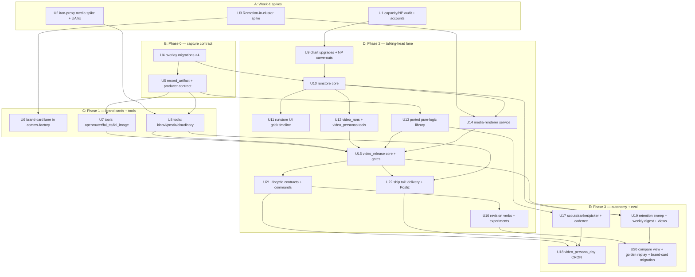

# feat: Video capabilities build-out

## Overview

Implement the decided video-capabilities architecture (`docs/plans/PLAN-2026-06-11-video-capabilities.md`): port the proven media pipeline from infinex-xyz/agents PR #157 ("daily") onto centaur's native rails — async provider tool plugins behind iron-proxy, an air-gapped `media-renderer` attached service (Remotion), a `runstore` artifact/trace store (3 pipeline tables + content-addressed blob PVC + UI), and overlay durable workflows with Slack gates — phased so content output rises at ~week 2 (brand cards), ~week 6–7 (operator-triggered talking-heads), ~week 10–11 (autonomous persona-days).

The architecture and all major decisions are already made and adversarially reviewed (9+ review passes across 4 investigations). This plan sequences the build into verifiable units and binds each to repo patterns, test scenarios, and the operational contracts surfaced by flow analysis.

---

## Problem Frame

Centaur/comms-factory produce text today; the org wants more content, specifically short-form video, produced on the prod k8s box and operated from Slack. PR #157 proved the media pipeline but is local-first macOS (files-on-disk state, launchd, Telegram) and cannot deploy. The port must preserve what makes daily improvable — the full per-run forensic record — without a laptop's run-folder, and must respect centaur's credential and network boundaries. (See origin §1 for the full cross-check.)

---

## Requirements Trace

- R1. Produce more video content, phased: animated brand cards by ~wk 2; operator-triggered talking-head shorts by ~wk 6–7; autonomous persona-day production by ~wk 10–11.
- R2. Run entirely on the prod k8s deploy box via existing centaur rails (durable workflows, tools plane, attached services, overlay mechanism); no laptop dependencies.
- R3. Slack is the operator surface: gates with thumbnails, structured rejection labels (per-verb buttons), the 6 `video …` workflow commands, weekly digest.
- R4. Full traceability from day one: every stage output durably recorded with provenance (producer/model/params/prompt+template sha/seed/cost/latency) and lineage edges; capture-time labels; agents can inspect runs (including pixels) from sandboxes.
- R5. Storage bounded by construction: sha256 dedupe, two retention classes (keep / 30d window), pin-on-label, write-time byte budget, two-phase GC; Cloudinary used only for post-approval delivery.
- R6. Credential boundaries preserved: provider keys via iron-proxy HttpSecret placeholders (one documented exception: cloudinary signs locally); media-renderer fully air-gapped (zero secrets, no internet egress); LLM-authored TSX executes only there.
- R7. Governance defaults: the ffmpeg clean chain (pixel disruption + iPhone-stock codec posture) ports IN FULL — it is distribution-critical, not a governance item; only the affirmative false-provenance sub-step (exiftool Apple-Keys atom injection claiming iPhone capture + CompressorName patch) defaults OFF behind a logged override. Plus honest `isAiGenerated`, human ship gate before any Postiz draft, hard daily caps.
- R8. The improvement loop works: gate→events double-emit feeds the ranker; variants run without redeploys; scorecard + gate-agreement views; weekly digest answers "is it getting better".
- R9. Throughput is not bounded by one pod or one blocking call: async submit/poll tools, bounded render queue, CRON fan-out via child runs.

---

## Scope Boundaries

- No auto-posting to social platforms — Postiz drafts only, behind a human ship gate (R7).
- No changes to comms-factory's editorial doctrine (ReleaseCard fact contract, Actor/Director) — its reuse is limited to the brand-card lane and caption critique.
- No GPU rendering, no Remotion Lambda — single-box CPU rendering with a bounded queue.
- No off-the-shelf observability platform (Phoenix/MLflow/Langfuse) — rejected in origin §1; OTel export remains a future option.
- No base slackbot TypeScript changes — gate UX uses the existing data-driven kit only.
- TikTok discovery/outlier research tooling from PR #157 (`daily/scripts/tiktok_*`) — out of scope entirely.

### Deferred to Follow-Up Work

- **Phase 4 items** (origin §10): `performance-observed` ingestion from Postiz metrics; R2/S3 offload if the CAS budget sustains pressure; iron-proxy domain-allowlist tightening; Phoenix OTel bolt-on. Future iteration after Phase 3 lands.
- **veo3/google_nano_banana fix + enablement** — no video workflow consumes them (veo3 has no audio-conditioning, so Kinovi carries the talking-head lane); revisit as provider-fallback posture under R9 if/when a fallback is wanted.
- Promotion pipeline for LLM-generated TSX components into the baked library (`compositions/daily-news/library/`) — process exists (PR + image rebuild) but tooling around it is follow-up.
- Ingress + auth for the runstore web UI (v1 access = port-forward / API-proxy; chart work tracked separately).

---

## Context & Research

### Relevant Code and Patterns

- **Tool plugin anatomy**: `tools/research/websearch/` (async methods, `secret()`, progress hooks, colocated `test_client.py`); `tools/media/veo3/` + `tools/media/nano-banana/` (media tools to fix/enable; naming precedent); `[tool.centaur]` manifest fields incl. `secrets` HttpSecret and `timeout_s` (`overlays/comms-factory/tools/comms_factory/pyproject.toml:14` is the only existing `timeout_s` use).
- **Overlay anatomy**: `overlays/comms-factory/` — thin-client tool pattern (`tools/comms_factory/client.py`: httpx, env-based service token, `{"ok": False}` error envelopes); **gate kit** `workflows/comms_shared.py` (`Gate`, `compact_ref`, `button`, `post_gate_message`, `wait_for_gate_action`, `validate_gate_event`, `call_comms_tool`, `SlackWorkflowInput`); `workflows/comms_release.py` (WORKFLOW_NAME/Input/handler shape; plain sibling imports — engine puts each workflow dir on sys.path).
- **Attached service anatomy**: `attached-services/comms-factory/services/api/server.ts` (route map, `/health` with capability booleans, bearer auth, single-line JSON logs, port 8080), `services/api/Dockerfile` (node:22-slim two-stage), chart declaration example `overlays/comms-factory/values.production.yaml:21-57` (incl. `serviceKey` → scoped key bootstrap via `contrib/chart/templates/_helpers.tpl:152-175`), `contrib/scripts/deploy-local.sh` `--with-comms-factory` wiring.
- **Workflow conventions**: `services/api/api/workflow_engine.py` — `ctx.step/sleep/wait_for_event/start_workflow/wait_for_workflow/run_workflow`; CRON shorthand (`CRON = "45 7 * * *"`, `SLACK_CHANNEL`) per `workflows/paradigm_pulse_daily.py`; `(workflow_name, trigger_key)` idempotent inserts (engine line ~1861); slackbot already passes `trigger_key = message_id` (`services/slackbot/src/centaur/handoff.ts:35`).
- **Chart**: `contrib/chart/templates/attached-services.yaml` (currently: no volumes/probes/per-service securityContext — the extension surface); `contrib/chart/templates/networkpolicy.yaml` (per-attached-service block lines ~169–217; no attached→attached edges exist; `networkPolicy.apiAdditionalEgress` escape hatch ~line 157); sandbox PVC precedent `services/api/api/sandbox/kubernetes_agent_sandbox.py` (`volumeClaimTemplates` via `KUBERNETES_SANDBOX_STATE_VOLUME_ENABLED`).
- **Migrations**: core `services/api/db/migrations/NNN_snake.sql` (idempotent DDL style per `021_slack_sync.sql`; current max 036); overlay set lives at `overlays/comms-factory/services/api/db/migrations/` (separate `schema_migrations_overlay` table; applied at API startup; verified by `services/api/tests/test_dbmate_migration_sets.py`). **Gotcha:** the `contrib/scripts/dbmate` wrapper's `OVERLAY_HOST_ROOT` defaults to `../centaur-paradigm` — set `CENTAUR_OVERLAY_HOST_DIR=overlays/comms-factory` when authoring.
- **Testing**: `services/api/tests/conftest.py` (ephemeral Postgres per session + migrations + httpx app client); workflow tests use duck-typed `FakeContext` (`services/api/tests/test_github_issue_triage_workflow.py:10-16`); tool tests colocate with the tool; overlay tests at `overlays/comms-factory/tests/` (sys.path-insert the overlay workflows dir). Lint/format: `uv run ruff check .` from repo root; E2E: `just build-one <svc>` → `just deploy` → real request.
- **Source material (external)**: PR #157 `daily/` tree — `daily_core/core/state.py` (16-status graph + 25-kind events), `daily_core/candidates/{scout,ranker,picker,planner}.py`, `daily_core/jobs/{qa,revise,draft}.py`, `daily_core/render/{kinovi.py,treatments.py}`, `daily_core/render/generative/` + `renderers/generative.py`, `remotion/render.mjs` + `remotion/generative/bridge.mjs` + `remotion/src/{templates,library}/`, `bot/postiz.py`, `prompts/`. Working clone expected at `/tmp/agents-pr157` (re-clone `infinex-xyz/agents` branch `feat/daily-harness-autonomy-plan` if absent).

### Institutional Learnings

(`docs/solutions/` does not exist; these come from CLAUDE.md, AGENTS.md, runbooks, and project memory.)

- **Invariants from the adversarial reviews** (origin §8): attachments are BYTEA — no media through them; attached services have zero direct 443 egress; iron-proxy strips User-Agent (Kinovi 403s); tools must be async with explicit `timeout_s` (default 120s kills veo3-style sync polls; worker concurrency defaults to 2); governance features default-OFF.
- **E2E gate driving on local k3s** (memory: comms-e2e-gate-driving): drive gates headlessly via `POST /workflows/events` with the exact compact-ref payload; localhost bypass does NOT cover `/workflows/*` (needs `SLACKBOT_API_KEY`); `slack.user_id` must match input `user_id`; first-write-wins on consumed correlations. Lift verbatim for video workflow E2E tests.
- **Local k3s traps** (CLAUDE.md): k3s ENFORCES NetworkPolicy (test carve-outs with enforcement on at least once); images must be imported into k3s containerd under `k8s.io` namespace; **grow the podman VM disk before building the renderer image** (disk-pressure GC already bit the 5.9GB agent image); secrets don't hot-reload (rollout-restart consumers).
- **Process rules** (CLAUDE.md): test locally E2E before pushing; never touch the deploy box (prod = git push → GH Actions); tools hot-reload so tool changes can be `curl`-tested from inside the API deploy.
- **Tool plane rejects unknown kwargs** — provider tool methods must be called with exact signatures.

### External References

External research is already embedded in the origin document (Remotion licensing/alternatives, artifact-store prior art, Cloudinary mechanics) — no new external research was needed for this plan.

---

## Key Technical Decisions

(Architecture decisions live in the origin doc; these are the plan-level placements.)

- **Video overlay content rides the existing org overlay** (`overlays/comms-factory/`): the chart mounts exactly one overlay image, so video workflows (`overlays/comms-factory/workflows/video_*.py`), video tools (`overlays/comms-factory/tools/{video_runs,video_personas}/`), and the overlay migration set (`overlays/comms-factory/services/api/db/migrations/`) all land there. Rationale: zero chart changes for mounting; the overlay is org-scoped, not product-scoped.
- **Provider tools are base tools** (`tools/media/…`): fal/kinovi/openrouter/postiz/cloudinary are generic capabilities, mirroring `tools/media/veo3`; enabled per-env via `api.enabledTools`.
- **New services are vendored in-repo** at `attached-services/{runstore,media-renderer}/` per the CLAUDE.md rule ("new standalone org services land here"), built by both deploy scripts with the same `$TAG`.
- **Flow-gap contracts are Phase-0-binding**: the flow analysis (this plan's research) found 15 operational gaps; the ones that change DDL (status enum additions `gate-expired`/`delivered`, `runs.active_run_id` mutex column) land in U4; producer-contract gaps land in U5; the rest bind to their workflow units below.
- **Spikes produce artifacts, not just knowledge**: U2 lands the iron-proxy user-agent allowlist change; U3 lands a written image recipe consumed by U14.

---

## Open Questions

### Resolved During Planning

- Where do video overlay pieces live → existing org overlay (see Key Technical Decisions).
- Whole program vs slice → whole program through Phase 3; Phase 4 deferred (Scope Boundaries).
- dbmate overlay authoring against in-repo overlay → `CENTAUR_OVERLAY_HOST_DIR=overlays/comms-factory` (U4 carries it).
- Gate timeout semantics, cancel cascade, per-job mutex, delivered/drafted split, CRON overlap guard, snapshot boundary → specified as unit contracts (U4, U5, U15–U18) from flow analysis.

### Deferred to Implementation

- Exact Remotion `--concurrency` and renderer requests/limits → tune in U14 against the spike data from U3 and the capacity audit from U1.
- Final gate timeout value (72h default) and reminder cadence (24h) → constants, adjustable after first weeks of operation.
- Per-provider result-TTL table (how long fal/kinovi keep results fetchable) → measure during U2 spike; bounds the park-on-budget-refusal horizon (U5).
- Exact thumbnail transform parameters and waveform rendering style → visual judgment during U10.
- Postiz instance URL/account wiring → operational config at U8 deploy time.

### From the 2026-06-12 document review (deferred findings)

- **[P1, U15] Rating-capture UX** — the base modal is a single text input; pick the shape before U15 implementation: (a) a 1–5 button row on the gate message, (b) a parseable modal convention, or (c) drop the rating from v1. The choice changes the gate block layout and the U5 payload contract. (design-lens)
- **[P1, U21] `video runs` reply format vs Slack's 50-block cap** — at ~20 jobs/day a naive per-job block listing exceeds the kit's hard cap within days; choose truncation, pagination, or a compact table (losing inline thumbs) before implementing video_query. (design-lens)
- **[P1, U1/U7/U8/U15] E2E provisioning + spend** — nothing provisions fal/kinovi/openrouter/cloudinary dev keys for local k3s (bootstrap script has no provider entries), no Postiz instance is confirmed to exist anywhere, and each full-pipeline E2E iteration spends real provider dollars. Decide: who provisions dev keys, where Postiz lives, what the accepted per-run E2E spend is, and whether a stub-provider cheap-mode is a planned artifact. The "test locally E2E before pushing" rule is at stake. (adversarial)
- **[P1, U5/U6] Phase-C byte home for brand-card mp4s** — between U6 (~wk 2) and runstore (~wk 4+), brand-card mp4s have no durable, traceable home (BYTEA attachments are banned for media; the comms-factory pod's disk is ephemeral). Decide: accept the brand-card lane as untraced until U20 (and scope R4's "day one" to the talking-head lane), or pull a minimal runstore slice forward. (adversarial)
- **[P2, U11] Tombstoned-artifact rendering states** — specify what replaces the video player for `ref='expired'` artifacts, and how thumb-present-blob-gone differs from both-gone, so the timeline inspection experience is consistent. (design-lens)

---

## High-Level Technical Design

> *This illustrates the intended approach and is directional guidance for review, not implementation specification.*

See origin §2 for the full system diagram. Unit dependency graph:

U6's only in-graph dependency is the U3 spike recipe (chromium layer + shm workaround); everything else it needs is comms-factory-internal.

---

## Implementation Units

### Phase A — Week-1 spikes & prerequisites

- [ ] U1. **Capacity/enforcement audit + external prerequisites**

**Goal:** Verify the assumptions the architecture stands on; clear the external account blockers.

**Requirements:** R2, R5

**Dependencies:** None

**Files:**
- Create: `docs/runbooks/video-capacity-audit.md` (findings record)

**Approach:**
- Verify NetworkPolicy enforcement on the prod deploy box (read-only inspection via logs/CI artifacts — never touch the box directly; CLAUDE.md rule).
- Audit deploy-box free CPU/RAM/disk vs the planned additions (renderer ~2cpu/4Gi, runstore PVC 30–50Gi, two images); record the box's CPU architecture (amd64 vs arm64 — decides which Chrome Headless Shell build U3/U14 must bake) and whether prod's `schema_migrations_overlay` table is empty (decides whether U4 can number from 001).
- Grow the local podman VM disk (`podman machine set --disk-size N`, VM stopped) before any image build.
- External: email hi@remotion.dev re company license (per-company; comms-factory already ships 4.0.460); confirm Cloudinary `infinex` plan/credit headroom with the account owner against ~600MB/day delivery scale.

**Test scenarios:**
- Test expectation: none — audit/operational unit; outputs are the recorded findings.

**Verification:**
- Runbook records: NP enforcement yes/no, capacity numbers, VM disk grown, license + Cloudinary answers (or owners + dates if pending).

---

- [ ] U2. **iron-proxy media-provider spike + user-agent allowlist**

**Goal:** Prove fal/Kinovi/Postiz/Cloudinary work through the MITM, and land the firewall config fix Kinovi needs.

**Requirements:** R6, R9

**Dependencies:** None

**Files:**
- Modify: `services/iron-proxy/iron-proxy.yaml` (add `user-agent` to `header_allowlist`)
- Modify: `services/api/api/iron-proxy.base.yaml` (same allowlist)
- Test: `services/api/tests/test_proxy_config.py` (extend)

**Approach:**
- Spike from a scratch pod on local k3s (enforcement on): fal submit+poll, fal CDN result fetch, Kinovi auth with a browser UA, Postiz multipart upload, Cloudinary signed upload of a multi-MB file via `upload_large`.
- Record each provider's result-TTL (how long a completed job's output stays fetchable) — bounds U5's park horizon.
- Land the user-agent allowlist change as a real config PR; verify it round-trips through `proxy_config.py` rendering.

**Test scenarios:**
- Happy path: rendered iron-proxy config includes `user-agent` in header_allowlist (config-render unit test).
- Integration (spike, recorded not automated): multi-MB multipart body through MITM completes; Kinovi request with UA passes Cloudflare.

**Verification:**
- Spike findings table (provider × auth ok / large-body ok / result-TTL) appended to U1's runbook; allowlist change merged.

---

- [ ] U3. **Remotion-in-cluster spike → image recipe**

**Goal:** De-risk headless Chromium rendering in k8s; produce the image recipe U14 consumes.

**Requirements:** R2, R9

**Dependencies:** None

**Files:**
- Create: `docs/runbooks/remotion-image-recipe.md`

**Approach:**
- Throwaway pod on local k3s rendering one of daily's compositions: pre-baked Chrome Headless Shell (no runtime download), Memory-medium `/dev/shm` emptyDir, `--no-sandbox` under the global dropped-caps securityContext, fonts present, compositor warmup, `--concurrency` vs CPU-limit behavior; verify the cluster's seccomp posture (`seccompProfile: RuntimeDefault`) permits the syscalls Chrome needs with `--no-sandbox` — the renderer executes LLM-authored TSX, so seccomp is a required compensating control, not an optional hardening.
- The sandbox base ships ffmpeg + Node but does **NOT** reliably ship chromium (`services/sandbox/Dockerfile` installs `chromium-browser || true` only on non-amd64; amd64 gets X11 libs only, relying on a runtime Chrome download the air-gapped renderer can never perform). The recipe MUST bake Remotion's Chrome Headless Shell for the prod box's architecture and verify its presence at image **build** time. Spike both base candidates — sandbox base vs purpose-built node:22 + chrome-headless-shell + ffmpeg (~4x smaller) — and record both sizes + render wall-clock for a 60s 1080x1920 composition so U14 picks with data.

**Test scenarios:**
- Test expectation: none — spike; the artifact is the recipe doc with measured numbers.

**Verification:**
- A test render completes in-cluster with enforcement on; recipe doc records image size, render time, and the exact Dockerfile sketch + chromium flags.

---

### Phase B — Phase 0: the capture contract (ships with the first pipeline PR)

- [ ] U4. **Overlay migrations ×4 (pinned DDL incl. state-machine deltas)**

**Goal:** Create the durable schema everything else writes into — the unbackfillable part.

**Requirements:** R4, R5, R8

**Dependencies:** None (lands with or before U5)

**Files:**
- Create: `overlays/comms-factory/services/api/db/migrations/001_video_runs.sql`
- Create: `overlays/comms-factory/services/api/db/migrations/002_video_events.sql`
- Create: `overlays/comms-factory/services/api/db/migrations/003_video_artifacts.sql`
- Create: `overlays/comms-factory/services/api/db/migrations/004_video_personas.sql`
- Create: `overlays/comms-factory/docs/video-event-payloads.md` (per-kind payload contracts)
- Test: `services/api/tests/test_dbmate_migration_sets.py` (extend), `overlays/comms-factory/tests/test_video_schema.py`

**Approach:**
- `runs`: job_id PK (stable logical id ≠ workflow run_id), workflow-run linkage, **active_run_id** (per-job single-writer mutex, flow gap 3), persona, run_date, format, status — daily's 16-status graph **plus `gate-expired` and `delivered`** (flow gaps 2, 7), candidate provenance, recipe_id/hash/snapshot, voice_id, pose_slug, postiz_post_id, variant_of self-FK, labels/ratings, final_artifact_id, total_cost_usd.
- `events`: 25-kind vocabulary + `provider-call-failed` (payload carries provider, model, params_hash, error, latency, cost, **disposition: failed|abandoned**, provider_job_id — flow gap 4) + `persona-day-skipped-overlap` (flow gap 6); index `(persona, kind, created_at)`.
- `artifacts`: full column set from origin §3 verbatim (provenance cols, input_artifact_ids[] GIN, thumb_sha256, retention, expires_at, variant, superseded_by; `UNIQUE(job_id, stage, name) WHERE superseded_by IS NULL`).
- `personas`: props (handle/accent/palette/font/motion brief), cadence config, voice_id ledger, asset CAS sha refs.
- Author with `CENTAUR_OVERLAY_HOST_DIR=overlays/comms-factory ./scripts/dbmate --set overlay new <name>`; idempotent DDL style per `services/api/db/migrations/021_slack_sync.sql`.

**Patterns to follow:** `services/api/db/migrations/021_slack_sync.sql`; overlay set mechanics in `services/api/tests/test_dbmate_migration_sets.py`; status graph + event vocabulary from PR157 `daily/daily_core/core/state.py` (LEGAL_TRANSITIONS at :101, EventKind at :60).

**Test scenarios:**
- Happy path: overlay set applies on the ephemeral test Postgres alongside core migrations; all 4 tables + indexes exist.
- Edge case: re-applying migrations is a no-op (idempotent DDL).
- Error path: inserting a second non-superseded artifact with same (job_id, stage, name) violates the partial unique index; superseding insert succeeds.
- Edge case: status transition helper (in U13) rejects transitions absent from the graph, including the new `gate-expired`/`delivered` arcs. **Failed-reachability contract (resolves the source-invariant collision):** `failed` is reachable from any state EXCEPT the post-spend protected set ({`delivered`, `drafted`} and parked-awaiting-TTL) — daily's "failed from any state" invariant is deliberately narrowed here, and U13's characterization test must encode this exception, not the verbatim source rule.
- Happy path: every event kind named in the payload-contract doc has its required fields enumerated (doc-completeness assertion).

**Verification:**
- `uv run pytest services/api/tests/test_dbmate_migration_sets.py overlays/comms-factory/tests/test_video_schema.py` green; migrations apply at API startup on local k3s.

---

- [ ] U5. **`record_artifact` helper + producer return contract**

**Goal:** One write path for every stage output, carrying full provenance, idempotent and outage-safe.

**Requirements:** R4, R5, R9

**Dependencies:** U4

**Files:**
- Create: `overlays/comms-factory/workflows/video_store.py` (shared module: record_artifact, events emit, status transitions)
- Test: `overlays/comms-factory/tests/test_video_store.py`

**Approach:**
- `record_artifact(job_id, stage, kind, name, data|cas_ref, provenance, inputs=[]) -> {artifact_id, ref, sha256}`: inline JSONB ≤100KB, else CAS PUT (via runstore once U10 exists; until then inline/attachment for small Phase-1 needs); idempotent on (job_id, stage, name, sha256); metadata row inserted before blob counts as live (GC contract).
- **Producer contract** (binding on U7/U8/U14 callers): provider submit is its own minimal `ctx.step` whose checkpoint (provider_job_id) is written before any result await (at-least-once safety, flow gap 4); failed attempts emit `provider-call-failed`; abandonment emits disposition `abandoned` with provider_job_id.
- **Park-not-fail** (flow gap 5): CAS-budget-refusal or store-down is a parking condition — ctx.sleep loop with escalating Slack alerts, never a step failure, since provider_job_id makes re-fetch spend-free within provider result-TTL (measured in U2).
- Gate→events double-emit helper: one ctx.step writing both the workflow event consumption and the `video_events` row.
- **Payload contracts are producer-enforced, not just documented:** the events-emit helper validates every payload against U4's per-kind required-fields table at write time — fail loudly in tests, log-and-alert in prod. A doc-completeness check alone lets production emissions drift while tests stay green (the 0.0-forever ranker failure, one level up).
- Checkpoint values are always `{artifact_id, ref, sha256}` — never bytes (engine canonical_json constraint).

**Patterns to follow:** `overlays/comms-factory/workflows/comms_shared.py` (ctx.step-wrapped helpers, step_kind tagging); `FakeContext` test style from `services/api/tests/test_github_issue_triage_workflow.py`.

**Test scenarios:**
- Happy path: small JSON lands inline with full provenance row; returns stable artifact_id.
- Edge case: identical (job_id, stage, name, sha256) recorded twice → one row, same artifact_id (idempotency).
- Edge case: superseding write (revision) chains superseded_by and keeps the partial-unique invariant.
- Error path: store-down simulation → helper parks (sleeps) and emits alert event; does not fail the step; resumes on recovery.
- Error path: provider failure path emits `provider-call-failed` with contracted payload fields.
- Error path: an emit with a missing required payload field fails the test run (write-time contract enforcement).
- Integration: gate double-emit writes exactly one `video_events` row per gate resolution (the ranker-feed invariant test, origin §3).

**Verification:**
- `uv run pytest overlays/comms-factory/tests/test_video_store.py` green; a toy workflow on local k3s records artifacts visible via SQL.

---

### Phase C — Phase 1: brand-card lane + tool plane (≈wk 1–2)

- [ ] U6. **Brand-card render lane in comms-factory**

**Goal:** First content-output increase: animated brand-card mp4s from approved release cards.

**Requirements:** R1, R3

**Dependencies:** U3 (blocking — the chromium image layer and the shm workaround come from the spike recipe; the wk-2 milestone is contingent on the spike outcome)

**Files:**
- Modify: `attached-services/comms-factory/services/api/server.ts` (add `/render` route)
- Create: `attached-services/comms-factory/services/api/routes/render.ts` (+ colocated `render.test.ts`)
- Modify: `attached-services/comms-factory/services/api/Dockerfile` (chromium + ffmpeg layer per U3 recipe)
- Modify: `overlays/comms-factory/workflows/comms_release.py` (render step + render gate)
- Modify: `overlays/comms-factory/tools/comms_factory/client.py` (render method)

**Approach:**
- Wire the existing dormant `src/remotion/render.ts` (data-card-official composition) behind an async job route; render gate in comms_release shows the mp4 via the existing gate kit; `/health` gains a `render` capability boolean (workflows can't read service env — probe pattern from the comms runbook).
- `POST /render` follows the existing `requirePostAuth` pattern from `server.ts` — auth check at the top of the handler before any job creation.
- Chromium-in-this-pod runs BEFORE U9's chart shm support exists: apply the U3-validated workaround for the interim (`--disable-dev-shm-usage` or equivalent from the spike recipe); the proper Memory-medium `/dev/shm` arrives with U9.
- Honest framing (origin §10): raises output; does not de-risk the talking-head lane.

**Patterns to follow:** existing `attached-services/comms-factory/services/api/routes/*.ts` route+test shape; gate usage in `overlays/comms-factory/workflows/comms_release.py`.

**Test scenarios:**
- Happy path: POST /render with a valid card id returns job id; poll reaches completed with mp4 + poster.
- Error path: POST /render without Authorization header → 401 (requirePostAuth).
- Error path: unknown card id → 4xx with error envelope; render gate not posted.
- Error path: render failure → job status failed with stderr captured; workflow surfaces a Slack message, run resumable.
- Integration: comms_release with render enabled posts the render gate after copy approval; approve continues, reject ends cleanly.

**Verification:**
- On local k3s: full comms_release run produces an animated brand card and posts it to the gate thread; `just logs` shows render job lifecycle events.

---

- [ ] U7. **Provider tools batch 1: `openrouter`, `fal_tts`, `fal_image`**

**Goal:** The LLM + TTS + hero-still tool plane, async and manifest-correct.

**Requirements:** R6, R9, R4

**Dependencies:** U5 (producer contract)

**Files:**
- Create: `tools/media/openrouter/{client.py,pyproject.toml,test_client.py}`
- Create: `tools/media/fal_tts/{client.py,pyproject.toml,test_client.py}`
- Create: `tools/media/fal_image/{client.py,pyproject.toml,test_client.py}` (nano-banana-2 hero stills; named to avoid colliding with existing `tools/media/nano-banana`)

(veo3/google nano-banana fixes moved to Deferred Follow-Up Work — no video workflow consumes them.)

**Approach:**
- All async `def` methods (supported per `tools/research/websearch/client.py`); split submit/poll methods so workflows drive waiting via `ctx.sleep` (30–60s, iteration-named steps); explicit `timeout_s` manifests; HttpSecret manifests with exact hosts (openrouter.ai; fal.run + queue.fal.run).
- `fal_tts` implements re-clone-on-4xx against the personas voice_id ledger (U4 table), emitting a ledger-update event.
- Return shapes follow the U5 producer contract (provider_job_id surfaced on submit).

**Patterns to follow:** `tools/research/websearch/` (async client + secrets + colocated tests); `tools/media/veo3/pyproject.toml` manifest shape; PR157 `daily/daily.py` stage 4/5 for fal API specifics.

**Test scenarios (per tool, mocked HTTP):**
- Happy path: submit returns provider_job_id; poll transitions pending→done with result url/bytes ref.
- Error path: provider 4xx on submit → structured error (no retry storm); fal_tts 4xx voice → one re-clone then retry once, ledger updated.
- Edge case: poll on unknown/expired provider job → distinct "gone" result (feeds abandoned disposition).
- Error path: missing secret → KeyError from `secret()` at call time (manifest correctness).

**Verification:**
- `uv run pytest tools/media/` green; on local k3s with keys: `call openrouter generate '{...}'`-style curl from inside the API deploy round-trips; tools hot-reload (no image rebuild needed for iteration).

---

- [ ] U8. **Provider tools batch 2: `kinovi`, `postiz`, `cloudinary`**

**Goal:** The i2v + drafting + delivery tool plane.

**Requirements:** R6, R7, R9

**Dependencies:** U2 (UA allowlist), U5

**Files:**
- Create: `tools/media/kinovi/{client.py,pyproject.toml,test_client.py}`
- Create: `tools/comms/postiz/{client.py,pyproject.toml,test_client.py}`
- Create: `tools/media/cloudinary/{client.py,pyproject.toml,test_client.py}`

**Approach:**
- `kinovi`: port PR157 `daily/daily_core/render/kinovi.py` request/response handling but async submit/poll (never the 30-min sync loop); browser UA header (works post-U2); HttpSecret manifest host kinovi.ai.
- `postiz`: port `daily/bot/postiz.py` drafting + media upload; **`isAiGenerated` honest** (R7); idempotency via Postgres (runs.postiz_post_id), not file sidecars.
- `cloudinary`: the documented placeholder-model exception (origin §6) — real api_secret in-process via `secret()`, local request signing, `upload_large` chunked for video; idempotent on `public_id = job_id` (flow gap 7); delivery-folder upload only.

**Patterns to follow:** U7 tools; the exception posture mirrors comms-factory's Anthropic key handling.

**Test scenarios:**
- Happy path (each): submit/upload round-trip with mocked HTTP; correct host + auth header shapes.
- Error path: kinovi Cloudflare-style 403 without UA header is impossible by construction (UA always set — assert on request).
- Edge case: cloudinary re-upload same job_id → same public_id, no duplicate asset (idempotency).
- Error path: postiz draft failure returns structured error; no state mutation beyond the failure event (split-brain contract lives in U15).
- Happy path: postiz payload has `isAiGenerated: true` (governance regression test — must never silently flip).

**Verification:**
- `uv run pytest tools/media/kinovi tools/comms/postiz tools/media/cloudinary` green; spike-style manual round-trip per provider from the API deploy on local k3s.

---

### Phase D — Phase 2: talking-head lane (≈wk 3–7)

- [ ] U9. **Chart upgrades: attached-service volumes/probes/securityContext + NetworkPolicy carve-outs**

**Goal:** The deployment substrate both new pods need.

**Requirements:** R2, R6

**Dependencies:** U1

**Files:**
- Modify: `contrib/chart/templates/attached-services.yaml` (volumes: PVC + emptyDir incl. Memory `/dev/shm`; liveness/readiness probes; per-service securityContext; fsGroup)
- Modify: `contrib/chart/templates/networkpolicy.yaml` (attached→attached edge support; renderer→runstore)
- Modify: `contrib/chart/values.yaml` (schema defaults/examples)
- Modify: `contrib/scripts/deploy-local.sh` (build/import/enable runstore + media-renderer)
- Test: chart golden-render test if precedent exists, else `helm template` assertions in CI script

**Approach:**
- All additions optional per-service (existing comms-factory entry renders byte-identical without new keys — backwards compatibility is the hard requirement).
- PVC support modeled on the sandbox `volumeClaimTemplates` precedent (`services/api/api/sandbox/kubernetes_agent_sandbox.py`), adapted to the Deployment-shaped template (RWO, single replica).
- NP: a values-declared `egressToServices: [<name>]` list per attached service rather than hardcoding renderer→runstore.

**Test scenarios:**
- Happy path: `helm template` with comms-factory values unchanged → identical manifests (snapshot diff).
- Happy path: a service declaring pvc/probes/shm/securityContext renders all four correctly.
- Edge case: `egressToServices: [runstore]` renders exactly one new egress rule + matching ingress on the target; nothing for services without it.
- Error path: enforcement-on local k3s — renderer pod can reach runstore:8080 and NOTHING else external (verified by an in-pod probe during U14 E2E).

**Verification:**
- `just deploy` on local k3s with both new services enabled comes up clean; comms-factory unaffected.

---

- [ ] U10. **runstore service core (CAS + budget + thumbnails + GC API)**

**Goal:** The byte/thumb plane of the trace store.

**Requirements:** R4, R5

**Dependencies:** U4, U9

**Files:**
- Create: `attached-services/runstore/` (service source: blob PUT/GET/DELETE/stat with range requests, thumbnail/waveform/frame-0 derivation, byte-budget enforcement, /health)
- Create: `attached-services/runstore/Dockerfile`
- Modify: `overlays/comms-factory/values.production.yaml` + local values (attachedServices.runstore block, serviceKey, PVC)
- Modify: `overlays/comms-factory/workflows/video_store.py` (CAS-backed ref scheme goes live)
- Test: `attached-services/runstore/tests/` (service-level), `overlays/comms-factory/tests/test_video_store_cas.py`

**Approach:**
- Division of labor per origin §3: runstore owns the filesystem (flat `blobs/<aa>/<sha256>`), enforces the byte budget at PUT (refuses over budget), returns `{sha256, bytes, thumb_sha256}`, touches mtime on dedupe-hit; all Postgres writes stay in the API pod (video_store helper).
- GC endpoints: DELETE honors 48h-mtime grace; stat supports the sweep's candidate listing. Two-phase GC orchestration itself lands in U19.
- **Per-verb authorization (serviceKey-scoped, comms-factory pattern):** two token scopes — write-scope (PUT/GET; what the renderer and the API-pod helper hold) and admin-scope (DELETE/stat; held ONLY by the API pod's sweep path). The renderer must never hold DELETE — a shared single token would let any caller bypass the GC grace window. Declare both in the runstore `serviceKey`/values block.
- Renderer-job 404/429 semantics are U14's; runstore's contracts here are PUT(409-over-budget)/GET(404/206)/DELETE(grace-guard).

**Patterns to follow:** `attached-services/comms-factory/services/api/` (server shape, /health capabilities, bearer auth, JSON logs, Dockerfile staging); serviceKey declaration per `overlays/comms-factory/values.production.yaml:21-57`.

**Test scenarios:**
- Happy path: PUT new blob → stored at sha path, thumb derived (image→jpg ≤50KB; audio→waveform png; video→frame-0 jpg); GET with Range returns 206.
- Edge case: PUT duplicate sha → no rewrite, mtime touched, same response (dedupe).
- Error path: PUT over budget → 409 with budget detail (the park trigger); under budget again → accepted.
- Edge case: DELETE within 48h grace → refused; after grace → unlinked.
- Error path: GET unknown sha → 404; corrupted file (sha mismatch on read-verify) → 5xx + alert log line.
- Error path: DELETE with a write-scope token → 403 (per-verb authz).
- Integration: video_store.record_artifact round-trips a 5MB binary through PUT and lands the Postgres row with thumb_sha256.

**Verification:**
- Service tests green; on local k3s a seeded job's blobs+thumbs are fetchable via the API-pod helper; budget refusal observable by setting a tiny test budget.

---

- [ ] U11. **runstore web UI: runs grid + per-job timeline**

**Goal:** The human inspection surface (highest-value view first).

**Requirements:** R3, R4

**Dependencies:** U10

**Files:**
- Create: UI module within `attached-services/runstore/` (htmx templates + routes: `/ui/runs`, `/ui/jobs/{job_id}`)
- Test: route tests in `attached-services/runstore/tests/`

**Approach:**
- Grid: persona/date filters, status + cost + thumb strip per job. Timeline: stage-ordered artifacts with inline thumbs/audio/video (range requests), provenance panel per artifact, clickable lineage edges (input_artifact_ids), supersede chains shown as attempt history.
- **Data access (resolved):** the UI fetches from the `video_runs` tool's own HTTP endpoints (`POST /tools/video_runs/<method>` on api:8000) using runstore's serviceKey — the egress edge already exists in the NP template (attached service → api:8000), no new router and no runstore→Postgres connection. The UI literally consumes the same JSON agents get, making the drift-guard structural rather than aspirational (origin §3).
- v1 access: port-forward / API-proxy; no ingress (Scope Boundaries).

**Patterns to follow:** static run-review precedent `attached-services/comms-factory/scripts/build-actor-run-review.mjs` (grid shape); keep it boring.

**Test scenarios:**
- Happy path: seeded job renders timeline with all stages, thumbs load, video plays via range requests.
- Edge case: tombstoned artifact (`ref='expired'`) still renders metadata + thumb (the browsability invariant — origin §3 integration test).
- Edge case: job with a superseded chain shows both attempts ordered.
- Error path: unknown job_id → friendly 404 page.

**Verification:**
- Manual: port-forwarded UI walkthrough on a seeded local job matches the origin §2 inspection story.

---

- [ ] U12. **`video_runs` + `video_personas` overlay tools**

**Goal:** Agent-native inspection + persona CRUD, from sandboxes, via the tool plane.

**Requirements:** R3, R4

**Dependencies:** U10

**Files:**
- Create: `overlays/comms-factory/tools/video_runs/{client.py,pyproject.toml,tests/}`
- Create: `overlays/comms-factory/tools/video_personas/{client.py,pyproject.toml,tests/}`

**Approach:**
- `video_runs`: `timeline(job_id)`, `get_artifact(artifact_id, thumb=False)` (thumb=True returns content_base64 ≤50KB or registers a short-TTL attachment — agents must see pixels), `search(persona,kind,stage,qa_verdict,dates,variant)`, `lineage(artifact_id)` (both directions), `compare(a,b)` (**self-contained SQL JSON diff** over the artifacts table — params/provenance/scorecard delta; works in Phase D with no U20 dependency; U20 adds only the UI rendering), `annotate(job_id|artifact_id, labels)` (writes event + pins lineage).
- `video_personas`: create/update persona props rows; asset upload via attachment_id → CAS (small-files note per origin §4); list/show.
- **Write-method authorization:** `annotate` and all `video_personas` mutations require an operator identity — either the Slack `user_id` carried by the calling workflow (validate-gate-event pattern from comms_shared.py) or an explicit operator scope on the calling `sbx1.*` token. Default-deny for autonomous sandbox agents: an unattended persona-day child must not be able to pin arbitrary lineage (pin-budget exhaustion) or mutate persona assets mid-run. Read methods stay open to any sandbox.
- Thin-client pattern: SQL via the API pod's pool for metadata, runstore HTTP for bytes; `{"ok": False}` error envelopes.

**Patterns to follow:** `overlays/comms-factory/tools/comms_factory/client.py` (thin client, env service token, error envelopes, `_LONG_TIMEOUT`).

**Test scenarios:**
- Happy path: timeline returns stage-ordered artifacts incl. inline payloads; lineage walks both directions.
- Happy path: get_artifact(thumb=True) on an image returns base64 ≤50KB; on a video returns the frame-0 thumb.
- Edge case: annotate flips the lineage chain's retention to keep-1yr and emits the event (pin trigger).
- Error path: annotate/persona-mutation without operator identity → authorization rejection; read methods unaffected.
- Happy path: compare(a,b) returns params/provenance/scorecard diff from SQL alone (no runstore UI involved).
- Edge case: persona asset upload >few-MB → rejected with size guidance (BYTEA hazard guard).
- Error path: search with unknown kwarg → tool-plane kwarg rejection (exact-signature rule).
- Integration: from a sandbox on local k3s, `call video_runs timeline '{...}'` succeeds (egress = api:8000 only — proves the placement).

**Verification:**
- Overlay tool tests green; sandbox-side `call` round-trip verified per the E2E recipe.

---

- [ ] U13. **Ported pure-logic library: script stack + treatments + QA validators + state machine**

**Goal:** daily's verbatim-portable brain, as overlay library code with tests.

**Requirements:** R1, R4, R8

**Dependencies:** U5

**Files:**
- Create: `overlays/comms-factory/workflows/video_lib/{prompts/,planners.py,treatments.py,qa.py,state.py,lint.py}`
- Test: `overlays/comms-factory/tests/test_video_lib_{planners,treatments,qa,state}.py`

**Approach:**
- Port from PR157: prompt files (`daily/prompts/` + planner prompt fragments), treatment registry + validators (`daily_core/render/treatments.py`), QA validators (`daily_core/jobs/qa.py`) **adding `treatment` to QaFinding** (value in-hand at qa.py:140), the 16(+2)-status transition validator (from `state.py` LEGAL_TRANSITIONS + U4's new arcs), generative lint (`daily_core/render/generative/lint.py`) as the API-pod pre-filter.
- Script-stack stages become pure functions (prompt-in/JSON-out contracts) that U15 wraps in ctx.step LLM calls via the openrouter tool — no engine coupling in this unit.
- Drop macOS/file-system assumptions; humanize's 22 cadence rules and the em-dash/slop vocab port verbatim.

**Execution note:** characterization-first, with an honest step 0 — PR157's own QA tests build run-dirs at runtime through the file-system state layer being dropped, so no static fixtures exist. Step 0: extract a pure-function seam (validators take in-memory scene-plan/captions/events structures, not run_dir paths), then generate static golden fixtures ONCE by running PR157's test constructors and committing their serialized inputs/expected-verdicts to `overlays/comms-factory/tests/fixtures/`. Pin the PR157 commit SHA immediately (the clone exists today), not at porting start.

**Patterns to follow:** PR157 sources listed above; overlay test style (`overlays/comms-factory/tests/`).

**Test scenarios:**
- Happy path (per stage): golden-ish fixture → story-shape/scene-plan/library-fit/opening-hook outputs validate against the treatment schema.
- Edge case: scene-plan row with unknown treatment → validator rejects (fail-closed).
- Happy path: QA validators reproduce daily's verdicts on fixture run-dirs (V1 schema, V2 captions incl. em-dash + slop vocab, V4 attribution, V6 vo-presence); findings carry `treatment`.
- Edge case: state machine — every legal transition accepted, a sample of illegal ones rejected, terminal statuses absorb everything, `failed` reachable from any state EXCEPT the post-spend protected set (per U4's failed-reachability contract — the deliberate narrowing of daily's invariant).
- Error path: lint catches the known forbidden patterns (fetch/eval/import-url) in generative TSX fixtures.

**Verification:**
- `uv run pytest overlays/comms-factory/tests/test_video_lib_*` green; module imports clean under the overlay sys.path convention.

---

- [ ] U14. **media-renderer service (generic job API + compositions + generative bridge)**

**Goal:** The air-gapped render pod: JSON+assets in, mp4/stills/QA evidence out.

**Requirements:** R1, R2, R6, R9

**Dependencies:** U3 (recipe), U9, U10

**Files:**
- Create: `attached-services/media-renderer/` (job API server; `compositions/daily-news/` vendored from PR157 `remotion/src/`; `compositions/cover/`; generative `bridge` + `common-template.tsx`; render queue)
- Create: `attached-services/media-renderer/Dockerfile` (per U3 recipe: sandbox base + Remotion 4.0.460 + pre-baked Chrome Headless Shell)
- Modify: overlay values (attachedServices.media-renderer + `egressToServices: [runstore]`)
- Test: `attached-services/media-renderer/tests/` (route + queue tests; one real smoke render in CI if feasible, else local-k3s checklist)

**Approach:**
- `POST /render {composition_id, props, assets:[CAS refs], mode: typecheck|smoke|stills|full}` → job_id; `GET /jobs/{id}`; bounded queue with **429 when full** (workflow backs off via ctx.sleep) and **404 on unknown job after restart** (workflow re-dispatches — renders are spend-free; flow gap 9); 4xx validation errors are terminal for the stage.
- Pull assets from runstore into emptyDir scratch (`remotion-public/` + generative `src/generated/` scaffold); push outputs back to runstore via PUT; scratch discarded per job.
- **CAS-ref validation contract:** every asset ref MUST match exactly 64 lowercase hex chars (sha256) before any filesystem-path or URL construction — reject otherwise with a 4xx terminal job failure. Enforced at both the renderer's job intake AND runstore's GET path construction; this is the path-traversal/SSRF guard for the one pod that executes LLM-authored code.
- Zero secrets; egress only to runstore (NP from U9); pod securityContext explicitly sets `seccompProfile: RuntimeDefault` (or a verified custom profile from the U3 spike) in addition to dropped caps — the compensating control for `--no-sandbox` chromium running LLM-authored TSX. Generative TSX arrives as CAS refs (data), compiled at render time; QA evidence (typecheck.log, smoke frames, motion.json) pushed back as blobs for U5 recording by the workflow.
- **ffmpeg clean chain is a first-class, faithful port — it is load-bearing for reach, not an afterthought.** Port all of it verbatim: the pixel-disruption layer (regrade / color-shift, reproject = crop + lanczos + unsharp, the gauze pass = `gblur sigma=2.5` @0.20 + `alls=3` noise floor) and the iPhone-stock codec posture (x264 High@4.0, BT.709, yuv420p, AAC 44100 stereo 128k, `+faststart`, full metadata strip). These defeat platform perceptual-hashing / AI-look down-ranking and are just-correct encoding respectively — neither is deceptive. The ONLY governance-gated sub-step is the final exiftool Apple-Keys atom injection + CompressorName patch (R7), which is a config toggle on the last pass defaulting OFF, not a removed stage. Clean failure ships `final.uncleaned.mp4` with a warning (daily's behavior); emits clean-chain evidence (3 frame-pairs + ffmpeg pass logs).

**Patterns to follow:** comms-factory service anatomy; PR157 `remotion/render.mjs` + `remotion/generative/bridge.mjs` (modes map 1:1; `preview`→`full`).

**Test scenarios:**
- Happy path: full-mode job with fixture props + assets renders an mp4; outputs PUT to runstore; job reaches completed with output refs.
- Happy path: smoke mode returns first/last-frame stills; typecheck mode returns tsc log with pass/fail.
- Edge case: queue at capacity → 429; job submitted post-restart with stale id → 404.
- Error path: missing asset ref (runstore 404) → job failed with which-ref detail.
- Error path: malformed asset ref (non-64-hex, path chars, URL) → 4xx terminal rejection before any fetch.
- Error path: generative TSX that fails typecheck → mode result failed, evidence pushed, no render attempted.
- Happy path: clean chain runs all passes (regrade/reproject/gauze + x264 iPhone-stock posture); output ffprobes to the expected codec posture (High@4.0, BT.709, yuv420p, AAC, +faststart) — clean-chain fidelity is asserted, not assumed.
- Edge case: clean step failure → ships `final.uncleaned.mp4` + warning, never blocks; metadata-atom injection OFF by default (no Apple-Keys atoms in output unless the override is set).
- Integration (local k3s, enforcement on): renderer cannot reach any external host; can reach runstore; /dev/shm large enough for a 1080x1920 render (the U3 recipe assertions re-verified in situ).

**Verification:**
- A talking-head fixture (pre-made vo+hero+seedance assets) renders end-to-end on local k3s; image size + render time within U3's recorded envelope.

---

- [ ] U15. **`video_release` workflow + gates + Slack commands**

**Goal:** The core talking-head pipeline through final-cut approval, with the capture-time contracts. (Split per review: lifecycle contracts + commands = U21; ship tail = U22 — one unit carrying the program's five-way integration convergence was the highest-risk shape.)

**Requirements:** R1, R3, R4, R6, R9

**Dependencies:** U5, U7, U8, U12, U13, U14

**Files:**
- Create: `overlays/comms-factory/workflows/video_release.py`
- Create: `overlays/comms-factory/services/api/db/migrations/005_video_views.sql` (scorecard + `video_gate_agreement` views — moved here from U19 so the auto_if_qa_passes precondition accumulates data from the first gated run; the views read tables U4 already creates)
- Modify: `overlays/comms-factory/workflows/video_store.py` (job lifecycle helpers)
- Modify: overlay values (`SLACK_WORKFLOW_COMMANDS`: register all 6 anchored `video …` commands once here; implementations — `video <brief>` here, cancel/runs/status in U21, revise/experiment in U16)
- Test: `overlays/comms-factory/tests/test_video_release_workflow.py` (FakeContext), E2E per the gate-driving recipe

**Approach:**
- Pipeline per origin §5: brief → script stack (ctx.step LLM calls over U13 functions) → **script gate** → TTS/hero/seedance (U7/U8 submit-as-step + ctx.sleep poll) → render (U14) → QA (U13) → **final-cut gate** (thumbs; per-verb reject buttons + "other"; optional 1–5 rating — capture shape is an Open Question to resolve pre-implementation).
- **Snapshot contract** (flow gap 8): persona props + asset shas resolve into recipe_snapshot at job creation; all stages read only the snapshot; voice_id is the sole mid-run-refreshable field (evented).
- **Gate approver authorization:** script + final-cut gates accept any configured team member; carried via `validate_gate_event`'s user check (comms_shared.py pattern) — the model must be stated per gate, never left to implementer pattern-matching. (Ship-gate authorization, the strictest, lives in U22.)
- Gate label capture per origin §3 (per-verb buttons; verb→blamed_stage mapping; double-emit via U5 helper).
- Renderer interaction contracts: 429 → ctx.sleep backoff; 404 after renderer restart → idempotent re-dispatch (renders are spend-free); provider abandonment → `provider-call-failed` disposition=abandoned.
- **Contract checkpoint before real rows:** draft the FakeContext suite against U4's graph + payload doc and run it BEFORE any Phase-C/D code writes production runs/events rows — U4's frozen contracts are treated as provisional until this suite passes (the unbackfillable-data safeguard).

**Patterns to follow:** `overlays/comms-factory/workflows/comms_release.py` + `comms_shared.py` gate kit throughout; CRON-less Input dataclass per `SlackWorkflowInput`.

**Test scenarios (FakeContext unless noted):**
- Happy path: pipeline walk to final-cut approval — statuses advance per the graph; every stage records artifacts with lineage; checkpoints carry only {artifact_id, ref, sha256}.
- Happy path: final-cut reject via verb button → operator-rejected event with {blamed_stage, verb}; run pinned; status per graph.
- Error path: gate action from a non-authorized user → rejected by validate_gate_event; gate stays pending.
- Error path: renderer 429 → backoff and retry; renderer 404 after restart → re-dispatch; provider abandoned → disposition=abandoned, run parks then fails cleanly past TTL.
- Integration (E2E, local k3s): drive script + final-cut gates headlessly via `POST /workflows/events` per the recipe.
- Integration: every video_events row emitted by the full pipeline walk passes U4's per-kind payload contract (producer-enforcement assertion).

**Verification:**
- E2E on local k3s: `video <brief>` in the test channel reaches an approved final cut with the full timeline inspectable in the U11 UI.

---

- [ ] U21. **Run/job lifecycle contracts + operator commands**

**Goal:** The state-safety layer: mutex, gate expiry, cancel cascade, and the read/cancel command surface.

**Requirements:** R3, R4, R9

**Dependencies:** U15

**Files:**
- Create: `overlays/comms-factory/workflows/video_query.py` (read-only `video runs` / `video status` replies via the video_runs tool)
- Modify: `overlays/comms-factory/workflows/{video_release.py,video_store.py}`
- Test: `overlays/comms-factory/tests/test_video_lifecycle.py`

**Approach:**
- **Per-job mutex with liveness** (flow gaps 3 + crash-release): `runs.active_run_id` CAS at spawn, where acquisition succeeds if NULL **or the referenced workflow run is terminal** (failed/cancelled) — stale locks from crashed runs are stolen atomically, never hand-edited; U19's reconciliation clears stragglers as defense in depth. Without the liveness check, the first U15-era crash locks its job permanently.
- **Gate timeout/expiry** (flow gap 2): every gate carries a timeout (72h default) → `gate-expired` (non-pinning terminal, revivable via revise), 24h reminder, gate message updated to a closed rendering; timeout strictly < the 30d window.
- **Cancel cascade** (flow gap 1): `video cancel` fans to all non-terminal child runs, calls provider/renderer cancel for every checkpointed submitted-not-fetched provider_job_id per the kill-safety table (LLM free-kill; TTS/hero let-finish; seedance provider-cancel; render free-kill; post-approve never auto-cancel), and closes open gate messages.
- All commands pass `trigger_key = message_id` (existing handoff.ts behavior — stated as contract; duplicate Slack delivery creates one run).
- `video runs` / `video status` replies via the video_runs tool (compact rendering — reply format vs Slack's 50-block cap is an Open Question to resolve before implementation).

**Test scenarios:**
- Edge case: second concurrent run for same job_id → mutex rejection ("revision in flight").
- Edge case: crashed prior run (terminal) → next spawn steals the mutex.
- Edge case: gate timeout → `gate-expired`, reminder event at 24h, gate message updated to closed; revive via revise allowed.
- Edge case: cancel during seedance → provider cancel for checkpointed provider_job_id; cancel during render → free-kill; child runs cancelled; gates closed.
- Happy path: `video status <job>` returns status + stage + cost; `video runs <persona>` returns the day's jobs.
- Integration (E2E): duplicate Slack command delivery (same message_id) creates one run.

**Verification:**
- E2E: a run cancelled mid-seedance leaves no live child runs, no billing-active provider jobs, and closed gate messages; a deliberately crashed run's job accepts the next spawn.

---

- [ ] U22. **Ship tail: delivery + Postiz draft**

**Goal:** Post-approval delivery with the split-brain contract and the strictest gate.

**Requirements:** R1, R3, R6, R7

**Dependencies:** U15, U8

**Files:**
- Modify: `overlays/comms-factory/workflows/{video_release.py,video_store.py}`
- Test: `overlays/comms-factory/tests/test_video_ship.py`

**Approach:**
- On final-cut approve: cloudinary tool uploads to delivery (status `delivered`, idempotent on `public_id = job_id`) → **ship gate** (the strictest authorization: initiating operator or a configurable approver list — any Slack user who can see the message must NOT be able to authorize a Postiz draft) → postiz draft (status `drafted`).
- **Split-brain contract** (flow gap 7): Postiz failure leaves the run resumable at `delivered` — retryable ship step, exempt from failure-pinning (a healthy chain must not pin keep-1yr because the draft call flaked).
- Governance regression guards live here: honest `isAiGenerated`, drafts-only, never auto-post.

**Test scenarios:**
- Happy path: approve → delivered → ship gate → drafted; delivery URL recorded as the final's cloudinary: ref.
- Error path: cloudinary ok + postiz fail → status `delivered`, ship step retryable, NOT failure-pinned.
- Error path: ship-gate action by a non-approver → rejected; gate stays pending.
- Edge case: re-running the delivery step → same public_id, no duplicate asset.
- Integration (E2E): drive the ship gate headlessly; Postiz draft created with `isAiGenerated: true`.

**Verification:**
- E2E on local k3s: full chain `video <brief>` → approved → Cloudinary sandbox folder + Postiz draft, timeline complete in the U11 UI.

---

- [ ] U16. **Revision verbs + experiment fan-out**

**Goal:** Targeted re-runs and A/B variants as child runs, with sound identity semantics.

**Requirements:** R4, R8

**Dependencies:** U15, U21 (mutex + revival semantics)

**Files:**
- Create: `overlays/comms-factory/workflows/video_revise.py` (or verbs within video_release Input modes — decide at implementation)
- Modify: `overlays/comms-factory/workflows/video_store.py`
- Test: `overlays/comms-factory/tests/test_video_revise.py`

**Approach:**
- The 6 verbs port from PR157 `daily/daily_core/jobs/revise.py` as child runs against the same job_id: verb → artifact set to supersede → re-run downstream stages; supersede chains via superseded_by.
- **Preflight** (flow gap 12): verify every required input ref is live; fail fast listing expired stages with a full-re-run offer. **Revival extends retention** (window-edge race): on revive, extend `expires_at` of the surviving input chain by a fresh window (pin-for-run) — a point-in-time preflight alone lets the nightly sweep tombstone inputs mid-revision (day-29 revive, day-30 sweep, renderer 404s after fresh spend).
- **Experiments**: `video experiment <job_id> --override …` → variant child job (`runs.variant_of`); baseline = the exact non-superseded artifact_ids captured as the variant's lineage inputs at fan-out (flow gap 10); refused under the same per-job mutex; overrides merge → recipe_snapshot → recipe_hash.

**Test scenarios:**
- Happy path (per verb): correct artifact subset superseded; downstream stages re-run; earlier stages replay from cache.
- Edge case: revise on a job with expired window inputs → fast failure naming the expired stages.
- Happy path: experiment creates variant job with variant_of set and baseline lineage pinned; compare-able via U12.
- Edge case: experiment requested while a revision is in flight → mutex rejection.
- Edge case: revise on `gate-expired` run revives it (legal transition per U4 graph).
- Edge case: revive at window-edge → sweep runs that night → surviving inputs NOT tombstoned → render succeeds.

**Verification:**
- E2E: reject a local run with verb `background`, watch only hero+seedance+render re-execute; experiment with a prompt override produces a second job linked by variant_of.

---

### Phase E — Phase 3: autonomy + eval machinery (≈wk 7–11)

- [ ] U17. **Scouts + ranker + picker + cadence ports**

**Goal:** The "what to make" layer: candidates, scoring, selection.

**Requirements:** R1, R8

**Dependencies:** U13 (lib home), U7 (openrouter)

**Files:**
- Create: `overlays/comms-factory/workflows/video_lib/{scouts.py,ranker.py,picker.py,planner.py}`
- Test: `overlays/comms-factory/tests/test_video_candidates.py`

**Approach:**
- Port PR157 `daily_core/candidates/`: 3 scouts (news/list/tutorial; Grok via openrouter tool) writing candidate-kind artifacts; ranker's 6 components (fit/novelty/source-quality/recent-posts/format-mix/feedback-penalty) reading `video_events` via the (persona,kind,created_at) index; blacklist replay from source-blacklisted events; Sonnet picker with should_ship veto; planner `compute_needed` against the personas cadence config.
- Pick→job lineage: the chosen candidate's artifact_id becomes a lineage input of the job's first artifact.

**Test scenarios:**
- Happy path: ranker reproduces daily's component math on fixture pools (weights sum 1.0; clamps; deterministic tiebreak by candidate_id).
- Happy path: feedback_penalty computed from seeded approve/reject events is non-zero (the 0.0-forever regression test).
- Edge case: blacklisted host dropped pre-scoring; unblacklist tombstone lifts it.
- Edge case: compute_needed clamps at zero; rejected/failed jobs free slots; in-flight count correctly.
- Error path: scout provider failure emits provider-call-failed and yields an empty (not crashing) candidate set.
- Integration: ranker runs over REAL U15-emitted events (not seeded fixtures) and produces sane component scores — the producer-enforcement loop closed end to end.

**Verification:**
- `uv run pytest overlays/comms-factory/tests/test_video_candidates.py` green; a manual scout→rank run on local k3s produces a ranked slate visible via video_runs.search.

---

- [ ] U18. **`video_persona_day` CRON workflow**

**Goal:** Autonomous persona-days with caps and overlap safety.

**Requirements:** R1, R7, R9

**Dependencies:** U15, U21, U22, U17

**Files:**
- Create: `overlays/comms-factory/workflows/video_persona_day.py`
- Test: `overlays/comms-factory/tests/test_video_persona_day.py`

**Approach:**
- **Dispatcher pattern (engine constraint — verified):** the engine registers exactly ONE static schedule per workflow module; there is no API for N per-persona schedules from a table. So: a single engine-registered CRON tick (e.g. `*/30 * * * *`, no Slack delivery) whose handler reads the personas cadence config, computes which personas are due in their own timezones (zoneinfo arithmetic in the handler), and fans out children with `trigger_key = f"{persona}:{run_date}"` so duplicate ticks are idempotent via the engine's `(workflow_name, trigger_key)` insert.
- **Overlap guard** (flow gap 6): preflight "any non-terminal persona_day for this persona?" → skip + `persona-day-skipped-overlap` event.
- Fan out video_release child runs (`ctx.run_workflow`); **caps counted transactionally at final-cut approval, not fan-out** (flow gap 13); `auto_if_qa_passes` read at each decision point, never day-start snapshot (flow gap 11); parent always completes with a summary event enumerating child terminal states.

**Test scenarios:**
- Happy path: cadence with 2 slots fans out 2 children; summary event lists both terminals.
- Edge case: previous persona-day still running → skip with event, no children.
- Edge case: cap reached mid-day → remaining auto-approvals blocked, cap-reached alert, manual gates still allowed.
- Edge case: auto flag flipped off mid-day → next decision point honors it.
- Edge case: child failure/cancel → parent still completes successfully; failed child doesn't consume cap.

**Verification:**
- E2E: forced persona-day on local k3s (test cadence) produces gated drafts; second forced run during the first skips with the event.

---

- [ ] U19. **`retention_sweep` + `video_weekly_eval` CRONs**

**Goal:** Bounded storage in practice + the standing reader.

**Requirements:** R5, R8

**Dependencies:** U10, U15

**Files:**
- Create: `overlays/comms-factory/workflows/{video_retention_sweep.py,video_weekly_eval.py}`
- Test: `overlays/comms-factory/tests/test_video_retention.py`, `.../test_video_eval.py`

(The scorecard + `video_gate_agreement` views migration moved to U15 so the auto-enablement precondition exists from the first gated run.)

**Approach:**
- Sweep (nightly): expire window-class rows → tombstone (metadata+thumb survive) → candidate unreferenced blobs under Postgres advisory lock → runstore DELETE (48h grace honored service-side); **artifacts whose job has a non-terminal run (or live mutex) are exempt from that night's expiry** (the revive-at-window-edge guard, paired with U16's revival extension); pin-budget accounting; **provider-job reconciliation** (flow gap 4): late-fetch or provider-cancel stragglers with disposition events, plus stale-mutex clearing (defense in depth behind U21's liveness-CAS); Cloudinary lifecycle rule (approved-never-posted deletion after N days).
- Weekly eval: digest to Slack (QA pass rates by validator/treatment, rejections by blamed stage, cost/persona-day, agreement rates, pin-budget consumption, top/bottom thumbnails); **auto-disables `auto_if_qa_passes`** for a format whose agreement drops below the ≥80% bar (flow gap 11) with an alert.
- `video_gate_agreement` = confusion matrix of operator decision × QA verdict per (persona, stage, recipe_hash, format).

**Test scenarios:**
- Happy path: expired artifact tombstoned; blob unlinked only when no live row references the sha AND grace passed; pinned chain untouched.
- Edge case: artifact referenced by a non-terminal run at sweep time → exempt from expiry that night.
- Edge case: dedupe race — new row recorded during sweep → blob survives (the two-phase GC invariant, simulated).
- Happy path: agreement view computes the confusion matrix correctly on seeded decisions; below-bar format auto-disabled + alerted.
- Happy path: digest renders with seeded week of data; includes pin-budget figure.
- Edge case: reconciliation finds an abandoned provider job → late-fetches result into CAS or cancels, with the right disposition event.

**Verification:**
- Sweep run on seeded local data leaves byte-accounting consistent (SUM(bytes) of live rows == CAS du); digest posts to the test channel.

---

- [ ] U20. **Compare view + golden replay + brand-card migration**

**Goal:** Close the improvement loop's remaining surfaces; consolidate rendering.

**Requirements:** R8, R1

**Dependencies:** U16, U19

**Files:**
- Modify: `attached-services/runstore/` (compare view: UI rendering of U12's compare JSON — params diff + scorecard delta + side-by-side thumbs)
- Create: `overlays/comms-factory/workflows/video_golden_replay.py`
- Modify: `attached-services/media-renderer/compositions/` (brand-card composition moved in); `overlays/comms-factory/workflows/comms_release.py` (render step → media-renderer); comms-factory `/render` route deprecated
- Test: extend runstore route tests; `overlays/comms-factory/tests/test_video_golden_replay.py`

**Approach:**
- Golden replay: re-run a stored job's input_json under the current code, text-stages-only by default (no media spend — daily's workshop cut), full-media opt-in; comparator = the scorecard view diff.
- Brand-card migration per origin §4/§10: composition into `compositions/brand-card/`, comms_release renders via media-renderer, comms-factory image sheds chromium/ffmpeg.

**Test scenarios:**
- Happy path: compare view renders two variant jobs side by side with params diff + scorecard delta.
- Happy path: golden replay of a fixture job in text-only mode spends zero provider dollars (no media tool calls) and produces a scorecard diff.
- Edge case: replay under changed prompt template shows template_sha difference in the diff.
- Integration: comms_release renders a brand card via media-renderer end-to-end; old route returns 410.

**Verification:**
- E2E: experiment pair compared in the UI; brand cards ship through the consolidated renderer; comms-factory image size drops.

---

## System-Wide Impact

- **Interaction graph:** new tool plugins are auto-discovered/hot-reloaded by the API pod — `api.enabledTools` gating must be set per env before keys exist (missing-secret tools raise at call time, not load time). Overlay workflows share the engine's worker pool — bump `WORKFLOW_WORKER_CONCURRENCY` + `api.resources` (origin §8) before Phase D E2E.
- **Error propagation:** producer contract (U5) is the spine — provider failures become events, store outages become parking, renderer failures become re-dispatch/backoff/terminal per status code. Split-brain (delivered vs drafted) is the one place a "failure" is a resumable success-state.
- **State lifecycle risks:** per-job mutex (U15), persona-day overlap guard (U18), two-phase GC (U10/U19), gate expiry vs the 30d window (timeout strictly < window).
- **API surface parity:** the `video_runs` tool and the runstore UI consume the same JSON (drift guard); gate decisions double-emit so Slack and the events table never diverge.
- **Integration coverage:** the headless gate-driving E2E recipe is the backbone for U15/U16/U18 integration tests; NP enforcement must be ON for at least one local E2E pass per service-introducing unit (U9/U10/U14).
- **Unchanged invariants:** comms-factory's pipeline, values, and chart rendering are untouched until U20 (U9's snapshot-diff test enforces this); base slackbot ships zero new TS; base `attachments` table is never used for media; the engine itself is unmodified (all video logic is overlay + base tools + new services).

---

## Risks & Dependencies

| Risk | Likelihood | Impact | Mitigation |
|------|-----------|--------|------------|
| iron-proxy can't stream large multipart bodies | Med | High (blocks fal/postiz/cloudinary path) | U2 spike in week 1; fallback = direct-egress exception for the cloudinary tool host only, documented like the signing exception |
| Remotion rendering unstable in-cluster (shm/sandbox/warmup) | Med | High (blocks talking-heads) | U3 spike with the known fixes pre-applied; Replit postmortem failure modes checked explicitly |
| Deploy-box capacity insufficient (warm pool + renderer + PVC) | Med | High | U1 audit before any Phase-D work; renderer requests/limits + bounded queue; warm-pool size negotiable |
| Cloudinary quota/plan insufficient at video scale | Med | Med | U1 confirmation with real numbers (~600MB/day); delivery downgrade ladder; R2 escape hatch via scheme-prefixed refs |
| Remotion company license unresolved | Low | Med | U1 email; "Automators" $100/mo floor is the worst case; comms-factory precedent suggests org obligation already exists |
| Chart changes regress comms-factory | Low | High | U9 snapshot-diff test (byte-identical render without new keys) |
| runstore GC bug deletes live blobs | Low | High | Two-phase GC with grace + advisory lock designed in (U10/U19); tombstone browsability integration test; refcount includes thumb_sha256 |
| Operator drowns in gates before autonomy lands | Med | Med | auto_if_qa_passes + agreement view ship in Phase D (U15/U19-view subset if needed); 6 commands incl. cancel/revise from day one |
| PR157 clone drift (branch moves before port completes) | Low | Med | Pin the commit SHA NOW (the clone exists today; record it in this plan's Sources on first touch); vendored code carries the source SHA in module docstrings |

---

## Success Metrics

- Brand-card mp4s shipping from comms_release by end of Phase C.
- An operator can go `video <brief>` → approved talking-head short in Postiz drafts, all from Slack, by end of Phase D — and answer "why does it look wrong" from the timeline UI without a re-run.
- Autonomous persona-days running under caps with the weekly digest posting by end of Phase E.
- **Outcome dimensions (targets TBD with the org — capability alone is not success):** shipped videos/week at each phase boundary; gates-per-shipped-video (operator-leverage trend, should fall as auto_if_qa_passes enables); cost-per-shipped-video vs the ~$3.50/persona-day PR157 baseline (computable from `total_cost_usd` captured since U4).
- Storage: CAS byte total stable (window class constant-size) after 2+ weeks of daily cadence; zero base-`attachments` media rows.
- The feedback loop is live: ranker feedback_penalty non-zero after the first operator decisions (the daily-gap regression).

---

## Documentation / Operational Notes

- Update `CLAUDE.md` (living-document rule): new attached services, the video overlay surface, the dbmate `CENTAUR_OVERLAY_HOST_DIR` gotcha, renderer image notes.
- New runbooks from U1/U3 spikes; extend `docs/runbooks/comms-factory-centaur.md` patterns for the two new services (serviceKey bootstrap, health probes).
- Secrets: provider keys land in `centaur-infra-env` flavor secrets per env; remember secrets don't hot-reload (rollout-restart after patching).
- Prod rollout is git push → GH Actions only; every unit's E2E happens on local k3s first (CLAUDE.md hard rule).
- Capture post-implementation learnings (chart volume/probe pattern, NP carve-out pattern, Remotion-in-k8s recipe) — seed `docs/solutions/` or extend runbooks.

---

## Sources & References

- **Origin document:** `docs/plans/PLAN-2026-06-11-video-capabilities.md` (the consolidated architecture; its Appendix records the investigation history and superseded decisions)
- Source material: infinex-xyz/agents PR #157, branch `feat/daily-harness-autonomy-plan` (clone at `/tmp/agents-pr157`; re-clone if absent; pin SHA at U13 start)
- Gate kit + overlay precedent: `overlays/comms-factory/workflows/comms_shared.py`, `overlays/comms-factory/values.production.yaml`
- Engine: `services/api/api/workflow_engine.py`; chart: `contrib/chart/templates/{attached-services,networkpolicy}.yaml`
- E2E recipe: project memory "comms E2E gate driving" (`POST /workflows/events` headless gate pattern)
