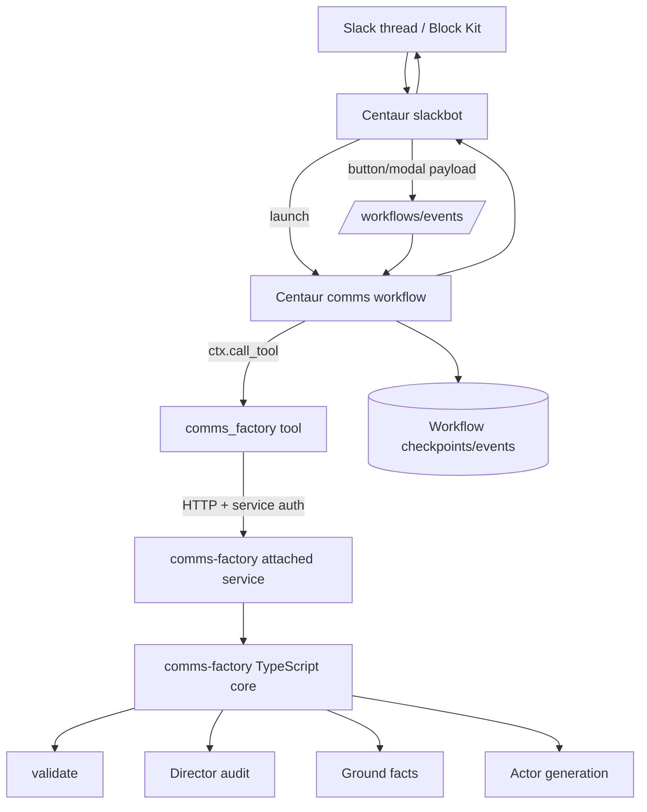
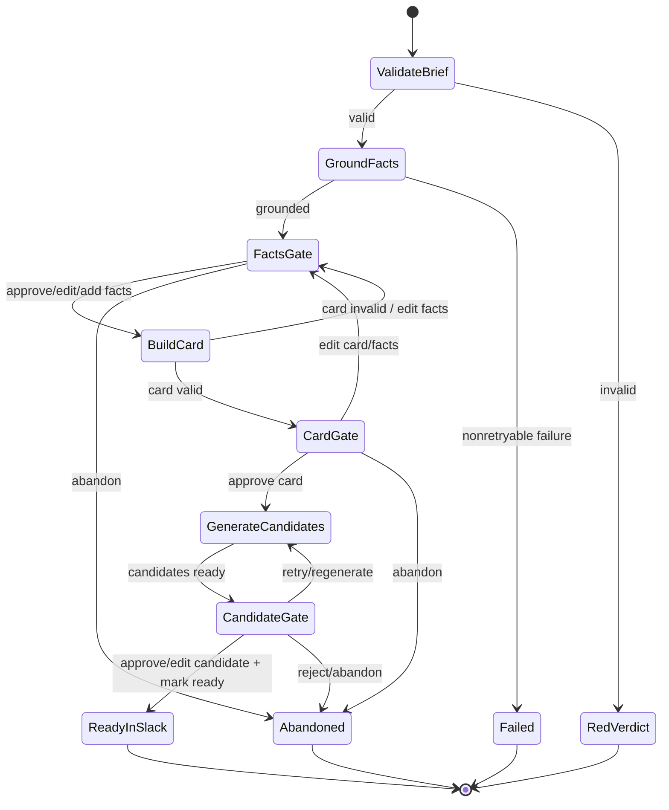
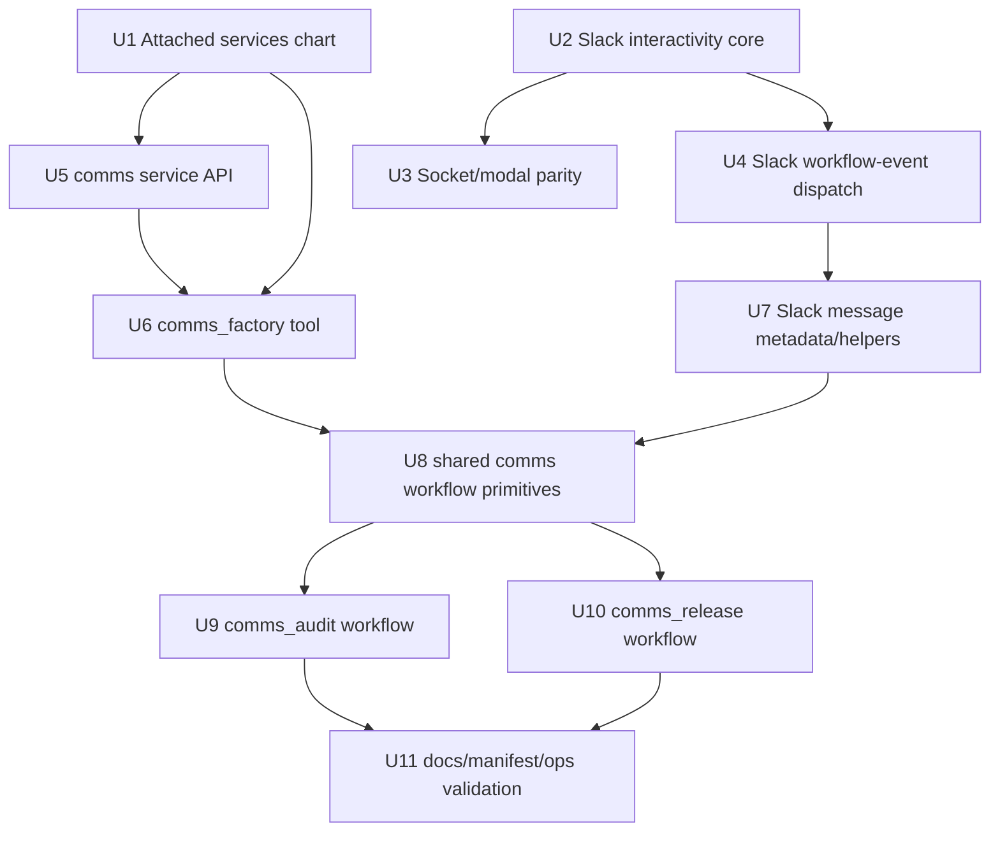

# feat: Integrate comms-factory as a Centaur attached service

## Summary

Integrate `infinex-dev/comms-factory` with Centaur by keeping the TypeScript comms domain runtime in its own internal Kubernetes service, exposing it through a thin Centaur tool, and letting Centaur workflows own Slack UX, human approval gates, checkpointed state, and final Slack delivery.

The MVP is buttons-first and modal-assisted: no typed approval commands, no production Next/SQLite harness, and no external auto-posting. “Ready to ship” means Slack-visible final copy only.

---

## Problem Frame

`comms-factory` already contains domain-specific copy validation, grounding, Actor generation, and Director judgment logic. Centaur already has durable workflows, Slack delivery, plugin tools, overlays, and Kubernetes deployment control. The integration should join those strengths without porting TypeScript code into Python, bloating the API container, or letting Slack approval state drift into an ad-hoc harness.

This plan also establishes a reusable Centaur extension pattern for heavier non-Python runtimes: deploy them as internal attached services and expose them only through tools/workflows.

---

## Requirements

- R1. Keep `comms-factory`’s human ship gate: generated copy must never auto-post to X, web, or in-product surfaces.
- R2. Preserve Actor/Director separation: generation and judgment remain distinct service/tool operations.
- R3. Preserve Director grounding rules: Director audit must not self-ground; human fact Q&A or supplied facts are the only audit fact source.
- R4. Ensure generation is grounded: `generate` must flow through grounding, human fact approval, `ReleaseCard.deployed_facts`, then Actor/Director.
- R5. Run deterministic validation first for both audit and generation lanes.
- R6. Treat `ReleaseCard.deployed_facts` as the fact contract for generated copy.
- R7. Capture operator approve/edit/reject/retry decisions as workflow state/training signal.
- R8. Show progress for long-running grounding and generation stages.
- R9. Keep the `comms-factory` Next/SQLite harness local-only; do not deploy it as production state or UX.
- R10. Add Centaur attached-service support so native runtimes can run beside the API without being embedded in it.
- R11. Use structured Slack interactions for gates: buttons first, modals for typed edits/Q&A, shortcuts/App Home later.
- R12. Route Slack interactions to durable workflow events with per-gate correlation IDs so sequential gates do not collide.
- R13. Enforce approval authority and stale-action handling before accepting a human gate decision.

---

## Scope Boundaries

- No external publishing in MVP. `channels: ["x", "web"]` means requested copy formats, not destinations that Centaur posts to.
- No thread-text approval parser. Mentions can launch workflows, but approvals/edits happen through buttons and modals.
- No production deployment of `comms-factory`’s Next/SQLite harness.
- No dedicated analytics table for MVP unless implementation proves workflow checkpoints/events are insufficient.
- No full App Home queue, message shortcuts, global shortcuts, reactions-as-approval, or link unfurls in the first shipped increment.
- No public ingress to the attached comms service. Agents and users interact through `/tools/comms_factory/*` and workflows only.

### Deferred to Follow-Up Work

- Dedicated `comms_decisions` Postgres table for long-term training analytics once query/reporting needs justify it.
- App Home approval queue and Slack shortcuts after the button/modal flow is stable.
- Reaction-based approvals only after correlation, authorization, and stale-click behavior are proven robust.
- External publishing actions, if ever added, as a separate workflow with explicit second confirmation and separate authorization.

---

## Context & Research

### Relevant Code and Patterns

- `contrib/chart/values.yaml`, `contrib/chart/values.schema.json`, `contrib/chart/templates/workloads.yaml`, `contrib/chart/templates/services.yaml`, `contrib/chart/templates/networkpolicy.yaml`, `contrib/chart/templates/_helpers.tpl` — Helm component values, workloads, services, and NetworkPolicy patterns.
- `contrib/chart/Chart.yaml` — chart changes require a version bump.
- `services/slackbot/src/index.ts` — Slack HTTP routes, signature middleware, message/update endpoints, and current `/api/slack/actions`/`/api/slack/options` placeholders.
- `services/slackbot/src/slack/socket-mode.ts` — Socket Mode events/commands exist; `interactive` and `options` are currently ack-only and need parity with HTTP interactivity.
- `services/slackbot/src/slack/signature.ts` — Slack signature verification pattern for HTTP interactive payloads.
- `services/slackbot/src/centaur/handoff.ts` — existing API handoff client pattern.
- `services/api/api/routers/workflows.py` — `POST /workflows/events` requires `agent:execute` or `admin` scope.
- `services/api/api/workflow_engine.py` — `ctx.step(...)`, `ctx.wait_for_event(...)`, and `ctx.call_tool(...)`; workflow events are matched by `event_type + correlation_id`.
- `services/api/api/slackbot_client.py` — API-side Slackbot posting/session/status helper with retry behavior.
- `services/api/api/workflows/agent_turn.py`, `services/api/api/workflows/slack_thread_turn.py` — built-in workflow examples.
- `docs/pages/extend/tools.mdx`, `docs/pages/extend/workflows.mdx`, `docs/pages/extend/overlay.mdx` — tool/workflow/overlay contracts.
- `contrib/manifests/slack-app-manifest.json` — Slack app settings; interactivity must be enabled for HTTP interactivity deployments.

### Institutional Learnings

- Prefer overlays for org-specific tools/workflows. Base Centaur should only grow generic platform capabilities such as attached services and Slack interactivity plumbing.
- Workflow events are first-emit-wins for a given `(event_type, correlation_id)`. Human gates must use stage/version-specific correlation IDs, not only `run_id`.
- Default-deny NetworkPolicies are intentional. Attached services need explicit API-to-service allow rules and service auth; cluster reachability alone is not enough.
- Socket Mode is env-gated and single-replica by default; interactive/options frames require explicit routing if buttons/modals must work without public webhooks.

### External References

- Slack Interactivity overview: <https://docs.slack.dev/interactivity/>
- Block Kit: <https://docs.slack.dev/block-kit/>
- Button element: <https://docs.slack.dev/reference/block-kit/block-elements/button-element/>
- Modals: <https://docs.slack.dev/surfaces/modals/>
- Shortcuts: <https://docs.slack.dev/interactivity/implementing-shortcuts/>
- Events API and Socket Mode: <https://docs.slack.dev/apis/events-api/> and <https://docs.slack.dev/apis/events-api/using-socket-mode/>
- Message metadata: <https://docs.slack.dev/messaging/message-metadata/>

---

## Key Technical Decisions

| Decision | Rationale |
|---|---|
| Deploy `comms-factory` as a separate internal Deployment/ClusterIP service. | Avoids porting TypeScript to Python, avoids adding Node runtime concerns to the API image, and lets comms roll out/restart independently. |
| Add generic `attachedServices` chart support first. | The pattern is broadly useful for future TypeScript/Go/Rust/Ruby/JVM integrations; `comms-factory` is the first concrete consumer. |
| Keep the Centaur tool as the public capability boundary. | Agents call `/tools/comms_factory/*`; the tool calls the attached service. The attached service is not public and is not an agent-facing URL. |
| Let workflows own async state and approval state. | Centaur already has checkpoint/replay and `wait_for_event`; the comms service can remain request/response oriented for MVP. |
| Use per-gate workflow event correlation IDs. | `workflow_events` are keyed by `(event_type, correlation_id)`, so `run_id` alone would make the first click block later gates. |
| Make Slack interactivity reusable infrastructure before comms-specific UI. | Buttons, modals, shortcuts, and Socket Mode interactive parity are platform needs, not just comms code. |
| Store large state in workflow checkpoints, not Slack payloads. | Slack button `value` and modal metadata are size-limited; payloads should carry compact references only. |
| Enforce no-auto-post in workflow scope and tool contract. | “Mark ready” must only update/post final copy in Slack; future external publishing is a separate explicit workflow. |

---

## Open Questions

### Resolved During Planning

- **Should attached services be sidecars or separate Deployments?** Separate Deployments. They get independent resources, restarts, rollouts, and can serve multiple API replicas.
- **Should all comms launches go through explicit workflows or agent-chosen tool calls?** Production lanes should be explicit workflows; agents may still call the tool ad hoc for diagnostics.
- **Should the MVP use typed thread commands for approvals?** No. Approval gates use buttons and modals only.
- **What should `Mark ready` do?** Post/update final copy in Slack and mark workflow state ready; it must not call X/web/in-product APIs.
- **How should gates correlate workflow events?** Use `correlation_id = f"{run_id}:{stage}:{gate_version}"` and include action metadata in the payload.

### Deferred to Implementation

- Exact Slack Block Kit layouts and text truncation rules after seeing real fact/candidate lengths.
- Exact `comms-factory` service framework choice (`Hono`, `Fastify`, or `Express`) inside the external repo.
- Whether fine-grained service progress should stream from `comms-factory` or remain coarse workflow step updates for MVP.
- Exact configured approver source beyond the default requester/admin-group model.

---

## Output Structure

Centaur-side work:

```text
contrib/chart/
├── values.yaml
├── values.schema.json
└── templates/
    ├── attached-services.yaml        # or added sections in workloads/services/networkpolicy
    ├── _helpers.tpl
    └── networkpolicy.yaml
services/slackbot/src/
├── centaur/
│   └── workflow-events.ts
├── slack/
│   ├── interactivity.ts
│   └── socket-mode.ts
└── index.ts
services/api/api/
├── slackbot_client.py
└── workflows/                        # only if base repo carries built-in examples
workflows/                            # overlay/external workflow location
├── comms_audit.py
└── comms_release.py
tools/comms_factory/                  # overlay preferred; base example optional
├── client.py
└── pyproject.toml
```

External `infinex-dev/comms-factory` work, paths relative to that repo:

```text
services/api/
├── server.ts
├── routes/
│   ├── validate.ts
│   ├── audit.ts
│   ├── ground.ts
│   ├── build-card.ts
│   └── generate.ts
└── Dockerfile
src/                                  # existing core remains authoritative
harness/                              # local-only training/debug UI
```

---

## High-Level Technical Design

> *This illustrates the intended approach and is directional guidance for review, not implementation specification. The implementing agent should treat it as context, not code to reproduce.*



Gate event rule:

```text
Slack action payload
  compact_ref = { run_id, stage, gate_version, action, target_id }

Slackbot validates signature/auth/staleness enough to route safely
  -> POST /workflows/events
       event_type: "comms.action"
       correlation_id: "{run_id}:{stage}:{gate_version}"
       payload: { compact_ref, slack_user, channel, message_ts, sanitized_values }

Workflow resumes exactly one current gate
  -> validates state/version/authority again
  -> records decision
  -> updates Slack surface, invalidating stale controls
```

Generation state machine:



---

## Implementation Units



### U1. Generic attached-service Helm support

**Goal:** Add a reusable Helm extension point for internal services deployed beside Centaur.

**Requirements:** R10

**Dependencies:** None

**Files:**
- Modify: `contrib/chart/values.yaml`
- Modify: `contrib/chart/values.schema.json`
- Modify: `contrib/chart/templates/_helpers.tpl`
- Create/Modify: `contrib/chart/templates/attached-services.yaml`
- Modify: `contrib/chart/templates/networkpolicy.yaml`
- Modify: `contrib/chart/Chart.yaml`
- Test: chart render/lint coverage via Helm template expectations if an existing chart test harness is present

**Approach:**
- Add `attachedServices` values keyed by service name with `enabled`, `image`, `service.port`, `env`, `secretEnv`, `resources`, and optional proxy/CA/env passthrough.
- Render a Deployment and ClusterIP Service per enabled attached service with Centaur labels/selectors.
- Add NetworkPolicy allowing Centaur API pods to reach enabled attached services and denying public ingress by default.
- Prefer deterministic service names such as `<release>-centaur-attached-<name>`.

**Patterns to follow:**
- Component labels/selectors in `contrib/chart/templates/_helpers.tpl`.
- Existing API/slackbot workloads and NetworkPolicy conventions in `contrib/chart/templates/workloads.yaml` and `contrib/chart/templates/networkpolicy.yaml`.

**Test scenarios:**
- Happy path: rendering with `attachedServices.comms-factory.enabled=true` creates one Deployment, one Service, and the expected API-to-service NetworkPolicy.
- Edge case: disabled or empty `attachedServices` renders no attached-service resources.
- Error path: missing required image repository/tag is rejected by schema or produces a clear Helm error.
- Integration: rendered env and secret refs match values and do not expose secret values inline.

**Verification:**
- Helm render/lint succeeds with default values and with a sample comms attached service enabled.
- Default chart behavior is unchanged when no attached services are configured.

---

### U2. Slack interactivity parser and action model

**Goal:** Parse Slack interactive payloads into a typed internal action model that supports buttons, modals, shortcuts, and options without routing them through the normal event handler.

**Requirements:** R11, R12, R13

**Dependencies:** None

**Files:**
- Create: `services/slackbot/src/slack/interactivity.ts`
- Create: `services/slackbot/src/slack/interactivity.test.ts`
- Modify: `services/slackbot/src/index.ts`
- Test: `services/slackbot/src/index.test.ts`

**Approach:**
- Parse `payload=` form bodies for `block_actions`, `view_submission`, `shortcut`, `message_action`, and options payloads.
- Extract compact refs from button `value`, `block_id`/`action_id`, or modal `private_metadata`.
- Validate shape, stage, action, and target identifiers enough to reject malformed payloads before dispatch.
- Keep Slack HTTP signature verification via existing `slackSignatureMiddleware`.
- Ack quickly and run non-ack work in background where possible.

**Patterns to follow:**
- `handleSlackEventBody(...)` extraction in `services/slackbot/src/index.ts`.
- Slack signature middleware in `services/slackbot/src/slack/signature.ts`.

**Test scenarios:**
- Happy path: signed `block_actions` payload with a valid compact ref is parsed into `{run_id, stage, gate_version, action, target_id}`.
- Happy path: `view_submission` payload returns sanitized submitted values plus modal metadata.
- Edge case: oversized or missing button value produces a safe error/ephemeral response, not a dispatch.
- Error path: malformed JSON in `payload=` returns a 400-style result without throwing.
- Integration: `/api/slack/actions` no longer passes interactive payloads to `handleSlackEventBody`.

**Verification:**
- Slack interactivity payloads have a dedicated parser and route path with tests for valid and invalid forms.

---

### U3. Modal support and Socket Mode interactivity parity

**Goal:** Make the same interaction core work through HTTP Slack interactivity and Socket Mode, and support opening/submitting modals for structured edits/Q&A.

**Requirements:** R8, R11, R12, R13

**Dependencies:** U2

**Files:**
- Modify: `services/slackbot/src/index.ts`
- Modify: `services/slackbot/src/slack/socket-mode.ts`
- Modify: `services/slackbot/src/slack/client.ts` if resolver/client typing needs modal helpers
- Test: `services/slackbot/src/slack/socket-mode.test.ts`
- Test: `services/slackbot/src/index.test.ts`

**Approach:**
- Replace ack-only `interactive`/`options` Socket Mode handling with calls into the same interaction core used by HTTP routes.
- For edit/Q&A actions, use Slack `trigger_id` to call `views.open` and store compact state in `private_metadata`.
- For `view_submission`, validate form fields synchronously where possible and return Slack field errors for invalid input.
- Dispatch workflow events only after modal values are valid.

**Patterns to follow:**
- Socket ack deadline handling in `services/slackbot/src/slack/socket-mode.ts`.
- Slack Web API resolver pattern in `services/slackbot/src/index.ts`.

**Test scenarios:**
- Happy path: Socket Mode `interactive` frame acks and routes to the same action handler as HTTP.
- Happy path: edit button opens a modal with `private_metadata` preserving run/stage/gate context.
- Happy path: valid modal submission dispatches a workflow event.
- Error path: expired/missing `trigger_id` returns/logs a user-visible failure and does not enter a workflow wait state.
- Error path: invalid modal field returns Slack modal errors and does not dispatch.

**Verification:**
- Buttons/modals behave equivalently in HTTP and Socket Mode deployments.

---

### U4. Slackbot workflow-event dispatch client

**Goal:** Dispatch accepted Slack interactions to Centaur’s durable workflow event API with safe auth, correlation, and sanitized payloads.

**Requirements:** R7, R12, R13

**Dependencies:** U2

**Files:**
- Create: `services/slackbot/src/centaur/workflow-events.ts`
- Create: `services/slackbot/src/centaur/workflow-events.test.ts`
- Modify: `services/slackbot/src/index.ts`
- Modify: `services/slackbot/src/config.ts` if additional workflow-event config is needed

**Approach:**
- POST to `/workflows/events` using `SLACKBOT_API_KEY`/existing Centaur API config.
- Build `correlation_id` as `{run_id}:{stage}:{gate_version}`.
- Include Slack team/channel/message/user IDs, action, target ID, gate version, and sanitized form values.
- Apply requester/approver checks as early as possible and leave final state/version validation to the workflow.
- Return ephemeral/user-visible errors for unauthorized, stale, or malformed interactions.

**Patterns to follow:**
- `services/slackbot/src/centaur/handoff.ts` for API handoff style.
- `/workflows/events` scope requirements in `services/api/api/routers/workflows.py`.

**Test scenarios:**
- Happy path: action dispatch posts expected `event_type`, `correlation_id`, and payload with bearer auth.
- Edge case: two stages for the same run produce different correlation IDs.
- Error path: API 403/5xx is logged and surfaced without duplicate unsafe dispatches.
- Security: payload sanitization excludes raw tokens, auth headers, and oversized Slack payload fragments.

**Verification:**
- A Slack action can wake a waiting workflow gate without colliding with later gates in the same run.

---

### U5. `comms-factory` lightweight service API

**Goal:** Add a production-oriented request/response API around `comms-factory`’s TypeScript core while keeping the harness local-only.

**Requirements:** R2, R3, R4, R5, R6, R8, R9

**Dependencies:** U1 for deployment target

**Files:**
- External repo create: `services/api/server.ts`
- External repo create: `services/api/routes/validate.ts`
- External repo create: `services/api/routes/audit.ts`
- External repo create: `services/api/routes/ground.ts`
- External repo create: `services/api/routes/build-card.ts`
- External repo create: `services/api/routes/generate.ts`
- External repo create: `services/api/Dockerfile`
- External repo test: service API route tests in the `infinex-dev/comms-factory` test structure

**Approach:**
- Expose `POST /validate`, `/audit`, `/ground`, `/build-card`, and `/generate`.
- Keep endpoints request/response oriented for MVP; return trace/progress summaries rather than owning async run IDs.
- Require service-to-service auth from the Centaur tool.
- Include `run_id`, `stage`, `gate_version`, and idempotency/attempt metadata in request bodies.
- Ensure `/audit` never self-grounds and `/generate` only accepts approved `ReleaseCard` facts.
- Emit structured logs with run ID, stage, prompt/model hashes where applicable, latency, and verdict — never secrets or full credentials.

**Patterns to follow:**
- Existing `comms-factory` `src/` core modules: validator, Actor/Director, fact grounder, card contract.
- Centaur logging contract from `AGENTS.md` when deployed alongside Centaur.

**Test scenarios:**
- Happy path: validate returns deterministic pass/fail before any LLM-backed route is used.
- Happy path: audit with supplied facts returns voice/fact verdict axes without invoking grounding.
- Happy path: generate with an approved ReleaseCard returns candidates plus Director verdicts.
- Error path: generate without `deployed_facts` or with unapproved facts is rejected.
- Error path: missing/invalid service auth is rejected.
- Integration: Docker image starts and serves health/API routes with the expected port.

**Verification:**
- The production service can be deployed as an attached service and called by Centaur without using the Next/SQLite harness.

---

### U6. `comms_factory` Centaur tool

**Goal:** Add a thin Centaur tool that exposes comms service capabilities to workflows and agents while hiding the attached service URL.

**Requirements:** R2, R4, R5, R6, R10

**Dependencies:** U1, U5

**Files:**
- Create: `tools/comms_factory/client.py` or overlay `tools/comms_factory/client.py`
- Create: `tools/comms_factory/pyproject.toml` or overlay `tools/comms_factory/pyproject.toml`
- Test: `tools/comms_factory/tests/test_client.py` or overlay equivalent

**Approach:**
- Implement `validate`, `audit`, `ground`, `build_card`, and `generate` methods that call the attached service with timeouts and clear error mapping.
- Read base URL and auth token from environment/secret manager; do not call `load_dotenv()` in `client.py`.
- Make the tool methods small wrappers; validation of comms domain rules stays in the service and workflows.
- Return structured dictionaries suitable for workflow checkpoints.

**Patterns to follow:**
- Tool plugin contract in `docs/pages/extend/tools.mdx`.
- Existing tool clients under `tools/*/*/client.py`, especially `httpx` usage and `pyproject.toml` metadata.

**Test scenarios:**
- Happy path: each method posts to the correct endpoint with the expected JSON body.
- Edge case: optional defaults (`voice_id`, `surface`, `channels`, `n`) are applied consistently.
- Error path: timeout/5xx from service becomes a workflow-readable error, not an unstructured traceback.
- Security: auth token is sent to the attached service but never returned in tool output/logs.

**Verification:**
- `/tools/comms_factory/validate` can be discovered/called from Centaur and reaches the attached service in local Kubernetes.

---

### U7. Slack message metadata and comms rendering helpers

**Goal:** Provide Slack posting/update primitives that let workflows render gates, update stale controls, and correlate messages with workflow run/gate state.

**Requirements:** R7, R8, R11, R12, R13

**Dependencies:** U2, U4

**Files:**
- Modify: `services/slackbot/src/index.ts`
- Modify: `services/api/api/slackbot_client.py`
- Test: `services/slackbot/src/index.test.ts`
- Test: `services/api/tests/test_slackbot_client.py`

**Approach:**
- Extend Slack message post/update helpers to accept Block Kit blocks and optional Slack message metadata when supported.
- Add API-side helper functions for posting required gate messages and updating messages after decisions.
- Treat required gate post failures as workflow-visible failures; workflows must not wait on an interaction surface that was never posted.
- Keep large gate state in workflow checkpoints; Slack metadata/button values carry only compact references.

**Patterns to follow:**
- Existing `/api/slack/messages` and `/api/slack/agent-sessions/*` endpoints in `services/slackbot/src/index.ts`.
- Retry behavior in `services/api/api/slackbot_client.py`.

**Test scenarios:**
- Happy path: message post/update accepts blocks and metadata and forwards them to Slack Web API.
- Edge case: metadata omitted preserves current behavior.
- Error path: Slack permanent error (`not_in_channel`, invalid blocks) is surfaced so the workflow can fail/pause rather than wait invisibly.
- Integration: accepted gate action updates prior message controls to a stale/disabled state.

**Verification:**
- Workflows can reliably post a facts/card/candidate gate and later update the same message after a decision.

---

### U8. Shared comms workflow primitives and state model

**Goal:** Create reusable workflow helpers for comms gate state, decision recording, progress updates, retries, and no-auto-post enforcement.

**Requirements:** R1, R4, R6, R7, R8, R12, R13

**Dependencies:** U4, U6, U7

**Files:**
- Create/Modify: `workflows/comms_shared.py` or shared module in the overlay workflow directory
- Test: workflow helper tests in overlay or `services/api/tests/test_comms_workflows.py` if carried in base repo

**Approach:**
- Model gate state with `stage`, `gate_version`, allowed actions, requester/approver IDs, target IDs, and terminal states.
- Generate event correlation IDs per gate/version.
- Record every accepted/rejected interaction with run ID, stage, gate version, Slack user/team/channel, action, target, prior value, and new value when relevant.
- Define retry policy: network/408/429/5xx retry with capped backoff; deterministic validation/schema errors are non-retryable and user-visible.
- Add explicit guardrails that workflow code only posts to Slack/checkpoints and never invokes external publishing tools.

**Patterns to follow:**
- `ctx.step(...)` and `ctx.wait_for_event(...)` in `services/api/api/workflow_engine.py`.
- Built-in workflow style in `services/api/api/workflows/slack_thread_turn.py`.

**Test scenarios:**
- Happy path: gate correlation ID includes run ID, stage, and gate version.
- Edge case: edit action increments gate version and invalidates earlier button refs.
- Error path: stale click is recorded/rejected and does not mutate current state.
- Security: unauthorized user action is rejected and does not wake/mutate the gate as approved.
- Integration: workflow does not enter `wait_for_event` if gate message post failed.

**Verification:**
- Both audit and release workflows share one consistent gate/event/state implementation.

---

### U9. `comms_audit` workflow fast lane

**Goal:** Implement a Slack-driven audit workflow for human-written copy using deterministic validation plus Director judgment.

**Requirements:** R2, R3, R5, R7, R8, R11, R12, R13

**Dependencies:** U6, U8

**Files:**
- Create: `workflows/comms_audit.py` or overlay equivalent
- Test: `services/api/tests/test_comms_workflows.py` or overlay workflow tests

**Approach:**
- Launch from a Slack mention such as `@centaur comms audit tweet: ...` while keeping gates structured.
- Run `comms_factory.validate` first; immediately render red verdict for deterministic failures.
- Run `comms_factory.audit` with supplied/human-confirmed facts only.
- If Director needs facts, render structured questions and collect answers through a modal; bound MVP to one Q&A round, then return amber with unresolved questions.
- Return green/amber/red with separate voice and fact axes.

**Patterns to follow:**
- Workflow plugin contract in `docs/pages/extend/workflows.mdx`.
- Slackbot client usage in existing workflows/API code.

**Test scenarios:**
- Happy path: valid copy with sufficient facts returns Director verdict without grounding.
- Happy path: missing facts opens Q&A modal; submitted answers rerun audit and update Slack.
- Edge case: Q&A remains insufficient after one round returns amber with unresolved questions.
- Error path: validator red short-circuits Director calls and returns a red verdict.
- Security: unauthorized modal/action submission cannot approve or alter the audit result.

**Verification:**
- A Slack user can audit existing copy end-to-end without any generated copy or external posting.

---

### U10. `comms_release` workflow generation deep lane

**Goal:** Implement the grounded generation workflow from brief to Slack-ready final copy with human gates at facts, ReleaseCard, and candidate stages.

**Requirements:** R1, R2, R4, R5, R6, R7, R8, R11, R12, R13

**Dependencies:** U6, U8, U9 patterns

**Files:**
- Create: `workflows/comms_release.py` or overlay equivalent
- Test: `services/api/tests/test_comms_workflows.py` or overlay workflow tests

**Approach:**
- Launch from a Slack mention such as `@centaur comms generate for x, web: ...`.
- Validate brief, ground facts, render facts gate, build ReleaseCard from approved facts, render card gate, generate candidates, render candidate gate, then mark final copy ready in Slack.
- Use buttons for approve/reject/retry/abandon and modals for edit/add facts, card edits, candidate edits, and retry notes.
- Retry repeats the immediately preceding automated stage with the latest approved inputs.
- Abandon is accepted at human gates; in-flight service cancellation is deferred for MVP.
- “Ready” only writes final copy/status in Slack and workflow output.

**Patterns to follow:**
- Shared helpers from U8.
- `services/api/api/slackbot_client.py` for progress/steps and message updates.

**Test scenarios:**
- Happy path: brief -> facts approval -> card approval -> candidates -> approve candidate -> ready in Slack.
- Edge case: operator edits facts; gate version increments and old fact buttons become stale.
- Edge case: generated candidate has red Director verdict; workflow requires explicit human action and records override/edit if allowed by configured policy.
- Error path: grounding 429/5xx retries with backoff and posts progress; deterministic schema error surfaces to Slack.
- Error path: Slack gate message cannot be posted; workflow fails/pauses and does not wait on an invisible gate.
- Security: mark-ready action by unauthorized user is rejected and cannot set `ready_to_ship`.
- Integration: no code path calls external X/web/in-product publishing APIs.

**Verification:**
- A Slack generation run can complete to “ready to ship” with all decisions checkpointed and no external publishing side effects.

---

### U11. Documentation, Slack app manifest, and local E2E validation

**Goal:** Document the integration, enable required Slack app settings, and prove the flow in the local Centaur stack before pushing.

**Requirements:** R1, R8, R10, R11, R12, R13

**Dependencies:** U1-U10

**Files:**
- Modify: `docs/pages/extend/overlay.mdx` or `docs/pages/extend/tools.mdx` if documenting attached services/tool usage in base docs
- Modify: `contrib/manifests/slack-app-manifest.json`
- Modify/Create: overlay README or runbook for comms workflows
- Test: local E2E script or documented curl/kubectl steps in the runbook

**Approach:**
- Document attached-service values and the expected `comms_factory` base URL/auth env.
- Enable Slack interactivity in the Slack manifest and document HTTP vs Socket Mode considerations.
- Add local validation steps: build affected services, deploy locally, render Helm, call tool endpoint, launch workflow, click/submit at least one gate.
- Keep production rollout notes explicit: no deploy-box testing, no external posting, local Kubernetes validation first.

**Patterns to follow:**
- Testing requirements in `AGENTS.md`.
- Existing extension docs under `docs/pages/extend/`.

**Test scenarios:**
- Happy path: local Helm deploy includes attached comms service and API can call `/tools/comms_factory/validate`.
- Integration: Slack button or Socket Mode interactive payload resumes a waiting workflow gate.
- Security: attached service is not reachable through public ingress and requires service auth.
- Regression: default chart values still deploy without comms service or Slack interactivity enabled.

**Verification:**
- The integration has a documented local proof path and a reproducible operator runbook.

---

## System-Wide Impact

- **Interaction graph:** Slackbot gains a reusable interactivity dispatch path; workflows gain human gate events; the API tool manager calls a new internal service through `comms_factory`.
- **Error propagation:** Slack parse/auth errors should be user-visible and not dispatch events; workflow tool/service failures should become workflow failures or visible retry states; Slack post failures must not create invisible waits.
- **State lifecycle risks:** Gate versions must invalidate old buttons/modals. Reusing correlation IDs can deadlock or wake the wrong gate. Workflow replay requires external Slack posts/tool calls inside `ctx.step(...)`.
- **API surface parity:** HTTP Slack interactivity and Socket Mode interactivity should use the same parser/action model. Tool methods should be stable for agents and workflows.
- **Integration coverage:** Unit tests alone will not prove the flow; E2E must cover Slack action -> `/workflows/events` -> `ctx.wait_for_event` resume.
- **Unchanged invariants:** Existing Slack event ingestion, agent handoff, final Slack delivery, and default Helm chart behavior remain unchanged unless comms/interactivity values are enabled.

---

## Risks & Dependencies

| Risk | Mitigation |
|------|------------|
| Workflow events collide across gates | Use `{run_id}:{stage}:{gate_version}` correlation IDs and checkpoint current gate version. |
| Unauthorized user approves ready-to-ship copy | Enforce requester/approver checks in Slackbot and workflow before mutating state. |
| Stale Slack buttons mutate newer state | Include gate version in payloads and reject stale versions with ephemeral feedback. |
| Slack modal/post failure creates invisible wait | Only call `wait_for_event` after required Slack surface is successfully posted/opened. |
| Attached service becomes publicly reachable | Use ClusterIP only, no ingress, explicit NetworkPolicy, and service auth. |
| Comms service long calls time out or duplicate expensive work | Use workflow retry policy, stage/attempt/idempotency metadata, and visible progress updates. |
| No-auto-post guarantee regresses later | Keep external publishing out of MVP workflow/tool methods and document any future publishing as a separate explicit workflow. |
| Generic `attachedServices` chart adds too much scope | Keep values minimal; if implementation gets large, land a comms-specific first component and defer generalization. |

---

## Documentation / Operational Notes

- Validate locally before pushing: build affected services, deploy to local Kubernetes, render Helm, and exercise a real workflow/tool call.
- If Socket Mode is used for local/staging interactivity, keep slackbot replicas at 1 unless shared dedupe/leader election is added.
- Attached service secrets should be injected through Kubernetes secrets or the existing secret manager/proxy path; never hardcode API keys.
- Structured logs should include run ID, stage, service operation, latency, and sanitized verdict metadata; never log copy-pasted secrets, auth headers, or raw tokens.

---

## Sources & References

Centaur source:

- `services/slackbot/src/index.ts` — Slack webhook routes, message endpoints, action/options route placeholders.
- `services/slackbot/src/slack/socket-mode.ts` — Socket Mode events/commands and current ack-only interactive/options handling.
- `services/slackbot/src/centaur/handoff.ts` — existing Slackbot-to-API handoff pattern.
- `services/slackbot/src/slack/normalize.ts` — message/app mention normalization and thread history collection.
- `services/api/api/routers/workflows.py` — `/workflows/runs` and `/workflows/events` API.
- `services/api/api/workflow_engine.py` — workflow checkpoint/event/tool primitives.
- `services/api/api/slackbot_client.py` — API-side Slackbot calls for messages, agent sessions, status, and stream events.
- `contrib/chart/values.yaml`, `contrib/chart/templates/workloads.yaml`, `contrib/chart/templates/services.yaml`, `contrib/chart/templates/networkpolicy.yaml` — Helm deployment patterns.
- `docs/pages/architecture.mdx`, `docs/pages/extend/tools.mdx`, `docs/pages/extend/workflows.mdx`, `docs/pages/extend/overlay.mdx`.
- `docs/plans/2026-06-03-001-feat-slack-socket-mode-plan.md` — Socket Mode implementation plan and constraints.

Comms-factory source referenced by the original integration research:

- `README.md`, `docs/ARCHITECTURE.md`, `docs/ROADMAP.md`, `docs/SPEC-director-as-service.md`.
- `harness/HANDOFF-SPEC.md`, `harness/SPEC-QUESTIONS.md`.
- `docs/generation-backend-walkthrough.html`, especially “How this fits a Slack bot or a new harness”.

Slack docs:

- Interactivity overview: <https://docs.slack.dev/interactivity/>
- Block Kit: <https://docs.slack.dev/block-kit/>
- Blocks reference: <https://docs.slack.dev/reference/block-kit/blocks/>
- Block elements reference: <https://docs.slack.dev/reference/block-kit/block-elements/>
- Button element: <https://docs.slack.dev/reference/block-kit/block-elements/button-element/>
- Modals: <https://docs.slack.dev/surfaces/modals/>
- Shortcuts: <https://docs.slack.dev/interactivity/implementing-shortcuts/>
- Slash commands: <https://docs.slack.dev/interactivity/implementing-slash-commands/>
- Events API: <https://docs.slack.dev/apis/events-api/>
- Socket Mode: <https://docs.slack.dev/apis/events-api/using-socket-mode/>
- Slack AI agents / assistant surfaces: <https://docs.slack.dev/ai/agents/>
- Message metadata: <https://docs.slack.dev/messaging/message-metadata/>
- Workflow steps: <https://docs.slack.dev/workflows/workflow-steps/>
